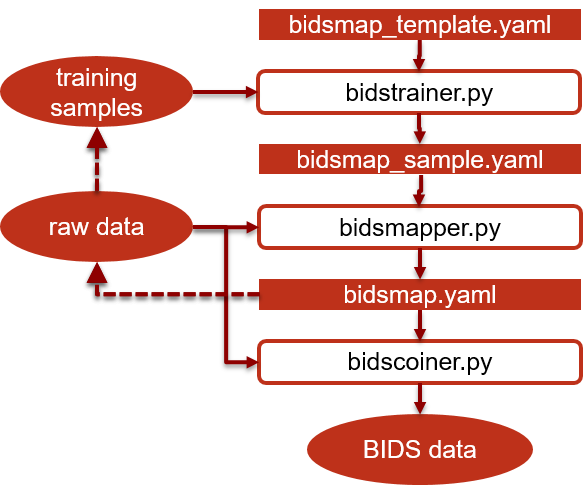
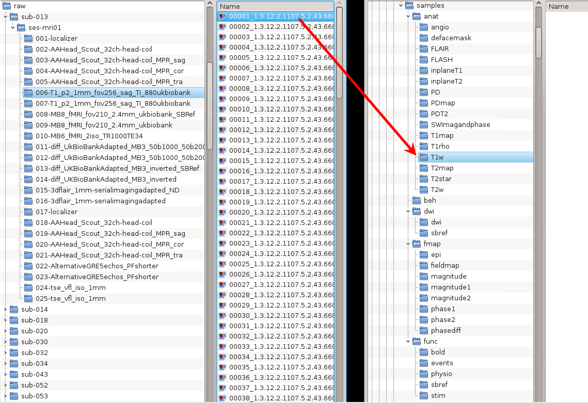

# BIDScoiner

BIDScoiner is a python toolkit that converts source-level (raw) MRI data-sets to nifti data-sets that are organized according to the Brain Imaging Data Standard, a.k.a. [BIDS](bids.neuroimaging.io). Rather then depending on logic, BIDScoiner uses a straightforward key-value approach to map the source data onto BIDS. The key values that can be used in BIDScoiner to map ("coin") the data are:

 1. Information in the MRI header files (DICOM, PAR/REC or .7 format, e.g. SeriesDescription)
 2. Information from nifti headers (e.g. image dimensionality)
 3. Information in the file structure (file- and/or directory names, e.g. number of files)

The key-value heuristics are stored in flexible, human readable and broadly supported [YAML](http://yaml.org/) files.

Currently, BIDScoiner is fully functional, although only option (1) has been implemented. (NB: Options (2) and (3) are planned for future versions, such that (3) takes precedence over (2), which in turn takes precedence over (1)).

BIDScoiner is a command-line tool that requires no programming knowledge in order to use it, just some basic file handling and, possibly, minor (YAML) text editing.

## The BIDScoiner workflow

BIDScoiner will take your raw data as well as a YAML file with the key-value mapping information as input, and returns a BIDS folder as output. Here is how to prepare the BIDScoiner inputs:

 1. **A minimally organised raw data folder**, following a  
 /raw/sub-[identifier]/ses-[identifier]/[seriesfolder]/[dicomfile]  
 structure. This data organization is how users receive their data from the (Siemens) scanners at the DCCN (NB: the ses-[identifier] sub-folder is optional and can be left out). 

    If your data is not already organized in this way, you can use the *dicomsort.py* command-line utility to move your unordered dicom-files into a [seriesfolder] organization with the series folders being named [SeriesNumber]-[SeriesDescription].
 
    Another command-line utility that can be helpful in organizing your raw data is *rawmapper.py*. This utility can show you the overview (map) of all the values of dicom-fields of interest in your data-set and, optionally, use these fields to rename your raw data sub-folders (this can be handy e.g. if you manually entered subject-identifiers at the scanner console and you want to use these to rename your subject folders).
 
    If these utilities do not satisfy your needs, then have a look at this more elaborate [reorganize_dicom_files](https://github.com/robertoostenveld/bids-tools/blob/master/doc/reorganize_dicom_files.md) tool.

 2. **A YAML file with the key-value mapping information**, i.e. a bidsmap.  There are two ways to create such a bidsmap.

    The first is if you are a new user and are working from scratch. In this case you would start with the *bidstrainer.py* tool (see *the bidstrainer* section below).

    If you have run the bidstrainer or, e.g. if you work in an institute where someone else (i.e. your MR physicist ;-)) has already performed the training procedure, you can use the training data to map all the files in your data-set with the *bidsmapper.py* tool (see *the bidsmapper* section below).

    The output of the bidsmapper is the desired bidsmap that you can inspect to see if your raw data will be correctly mapped onto BIDS. If this is not the case you can go back to the training procedure and change or add new samples, and rerun the bidstrainer and bidsmapper until you have a suitable bidsmap. Alternatively, or in addition to, you can directly edit the bidsmap yourself (this requires more expert knowledge but can also be more powerful). 
      
Having an organized raw data folder and a correct bidsmap, the actual data-set conversion to BIDS can now be performed fully automatically by running the *bidscoiner.py* tool (see the workflow diagram and *the bidscoiner* section below).

## The BIDScoiner tools

### The bidstrainer

    usage: bidstrainer.py [-h] bidsfolder [samplefolder] [bidsmapper]
    
    Takes example files from the samples folder to create a bidsmapper config file
    
    positional arguments:
      bidsfolder    The destination folder with the bids data structure
      samplefolder  The root folder of the directory tree containing the sample
                    files / training data. Optional argument, if left empty,
                    bidsfolder/code/samples is used or such an empty directory
                    tree is created
      bidsmapper    The bidsmapper yaml-file with the BIDS heuristics (optional
                    argument, default: ./heuristics/bidsmapper.yaml)
    
    optional arguments:
      -h, --help    show this help message and exit
    
    example:
      bidsmapper.py /project/foo/bids
      bidsmapper.py /project/foo/bids /project/foo/samples bidsmapper_dccn

The central idea of the bidstrainer is that you know your own scan protocol and can therefore point out which files should go where in the BIDS. In order to do so, you have to put sample files for each of the scan modalities / series in your protocol (e.g. T1, fMRI, etc) in the right folder of a semantic folder tree (named 'samples', see bidstrainer example below). If you run bidstrainer with just the name of your bidsfolder, bidstrainer will create this semantic folder tree for you in the *code* subfolder (if it is not already there). Generally, when placing your sample files, it will be fairly straightforward to find your way in this semantic folder tree, but in doubt you should have a look at the [BIDS specification](http://bids.neuroimaging.io/bids_spec.pdf). Note that the deepest foldername in the tree denotes the BIDS suffix (e.g. 'T1w').

If all sample files have been put in the right location, you can (re)run the bidstrainer to create a bidsmap YAML file for your study. How this works is that the bidstrainer will read a predefined set of (e.g. key dicom) attributes from your sample files that uniquely identify the particular scan sequence and, on the other, take the path-names of the sample files to infer the associated BIDS modality labels. In this way, a unique key-value mapping is defined that can be used as input for the bidsmapper tool (see next section). If this mapping is not unique (not likely but possible), or if you prefer to use more or other attributes than the predefined ones, you can (copy and) edit the bidsmapper.yaml file in the heuristics folder and use that as an additional input for the bidstrainer.

*Bidstrainer example. The red arrow depicts a raw data sample (left file browser) that is put (copied over) into the right location in the semantic folder tree (right file browser)*

### The bidsmapper

    usage: bidsmapper.py [-h] [-a] rawfolder bidsfolder [bidsmapper]
    
    Creates a bidsmap.yaml config file that maps the information from the data to the
    BIDS modalities and BIDS labels (see also [bidsmapper.yaml] and [bidstrainer.py]).
    You can edit the bidsmap file before passing it to [bidscoiner.py] which uses it
    to cast the datasets into BIDS folders
    
    positional arguments:
      rawfolder        The source folder containing the raw data in
                       sub-#/ses-#/series format
      bidsfolder       The destination folder with the bids data structure
      bidsmapper       The bidsmapper yaml-file with the BIDS heuristics (optional
                       argument, default: bidsfolder/code/bidsmapper_sample.yaml)
    
    optional arguments:
      -h, --help       show this help message and exit
      -a, --automatic  If this flag is given the user will not be asked for help
                       if an unknown series is encountered
    
    example:
      bidsmapper.py /project/foo/raw /project/foo/bids
      bidsmapper.py /project/foo/raw /project/foo/bids bidsmapper_dccn

The bidsmapper inspects all raw data folders of your dataset and saves the known and unknown key-value mappings in a (study specific) bidsmap YAML file. You can consider it as a dry-run for how exactly bidscoiner will convert the raw data into BIDS folders. It is therefore advised to inspect the resulting bidsmap.yaml file to see if all scan series were recognized correctly with proper BIDS labels (for more details, see *The bidsmap YAML file* section). This can be the case if your bidstraining or the bidsmapper.yaml file that was provided to you was incomplete. If so, you should either get an updated bidsmapper.yaml file or redo the bidstraining with new sample files, rerun the bidstrainer and bidsmapper until you have a suitable bidsmap.yaml file. You can of course also directly edit the bidsmap.yaml file yourself, for instance by changing some of the automatically generated BIDS labels to your needs (e.g. task_label).

### The bidscoiner

    usage: bidscoiner.py [-h] [-s [SUBJECTS [SUBJECTS ...]]] [-f] [-p]
                         [-b BIDSMAP]
                         rawfolder bidsfolder
    
    Converts datasets in the rawfolder to nifti datasets in the bidsfolder according to the BIDS standard
    
    positional arguments:
      rawfolder             The source folder containing the raw data in
                            sub-#/ses-#/series format
      bidsfolder            The destination folder with the bids data structure
    
    optional arguments:
      -h, --help            show this help message and exit
      -s [SUBJECTS [SUBJECTS ...]], --subjects [SUBJECTS [SUBJECTS ...]]
                            Space seperated list of selected sub-# names / folders
                            to be processed. Otherwise all subjects in the
                            rawfolder will be selected
      -f, --force           If this flag is given subjects will be processed,
                            regardless of existing folders in the bidsfolder.
                            Otherwise existing folders will be skipped
      -p, --participants    If this flag is given those subjects that are in
                            particpants.tsv will not be processed (also when the
                            --force flag is given). Otherwise the participants.tsv
                            table is ignored
      -b BIDSMAP, --bidsmap BIDSMAP
                            The bidsmap yaml-file with the study heuristics. If
                            the bidsmapfile is relative (i.e. no "/" in the name)
                            then it is assumed to be located in bidsfolder/code/.
                            Default: bidsmap.yaml
    
    examples:
      bidscoiner.py /project/raw /project/bids
      bidscoiner.py -f /project/raw /project/bids -s sub-009 sub-030

The bidscoiner tool is the workhorse of the toolkit that will fully automatically convert your source-level (raw) MRI data-sets to BIDS organized data-sets. You can run this tool after all data is collected, or repeatedly as new data is added to the raw folder.

After a successful run of bidscoiner, you can (and should) run the web-based [bidsvalidator](https://incf.github.io/bids-validator/) to check for inconsistencies or missing files in your bids data-set or use a [command-line version](https://github.com/INCF/bids-validator).

NB: The provenance of the produced BIDS data-sets is stored in the bids/code/bidscoiner.log file. This file is also very useful for debugging / tracking down bidsmapping issues.

## The bidsmap YAML file

The bidsmap.yaml file is a key-value store that contains all the mapping logic / heuristics for converting the raw data files into BIDS. The bidsmapper.yaml and the bidsmapper_sample.yaml files can be seen as precursors / templates of the bidsmap.yaml file and will not be explained separately. Put differently, they have parent-child relationships and only their differences will be mentioned.

The bidsmap.yaml file consists of a header and 

    # --------------------------------------------------------------------------------
    # Generic config file for bidsmapper with the default heuristics for identifying
    # the BIDS modalities and BIDS labels. Do not change/use this file but create a
    # separate file (e.g. [bidsmapper_<YourTagHere>.yaml]) with the same format to
    # set your site/study-specific heuristics (see [bidsmapper_dccn.yaml] and
    # [bidsmapper.py]). The bidsmapper config file can be passed to [bidsmapper.py]
    # which uses it when traversing through the datasets to generate the bidsmap.yaml
    # mapper file (see [bidsmap_example.yaml] for details). The datastructure of a
    # bidsmapper config file should be 5 levels deep and follow:
    # dict > dict > list > dict > dict
    # --------------------------------------------------------------------------------
    
    
    # --- Raw data template (this is how your raw input data structure is expected to be). See:
    #     https://github.com/robertoostenveld/bids/blob/master/doc/reorganize_dicom_dataset.md
    #
    # raw/<participant_label>/[<session_label>]/<acq_label>/[<acq_label>|*].[IMA|dcm]
    # [beh/<participant_label>[/<session_label>]<events_label>/[<events_label>|*].[log|txt|csv|tsv]]
    
    
    # --- BIDS 1.0.2 template (this is how your BIDS output data structure will look like)
    #
    # participants.tsv
    # participants.json
    # phenotype/<measurement_tool_name>.tsv
    # phenotype/<measurement_tool_name>.json
    # dataset_description.json
    # README
    # CHANGES
    # code/
    #     bidsmapper_sample.yaml
    #     bidsmap.yaml
    #     bidscoiner.py
    # derivatives/README
    # [stimuli/]
    # [sourcedata/]
    # raw/
    # [beh/]
    # sub-<participant_label>/[sub-<participant_label>_sessions.tsv]
    # sub-<participant_label>/[ses-<session_label>/]
    # 	sub-<participant_label>_scans.tsv
    # 	anat/
    # 		sub-<participant_label>[_ses-<session_label>][_acq-<acq_label>][_ce-<ce_label>][_rec-<rec_label>][_run-<run_index>][_mod-<mod_label>]_<modality_label>.nii[.gz]
    # 	func/
    # 		sub-<participant_label>[_ses-<session_label>]_task-<task_label>[_acq-<label>][_rec-<label>][_run-<index>][_echo-<index>]_bold.nii[.gz]
    # 		<matches>_events.tsv
    # 		<matches>[_recording-<recording_label>]_physio.tsv.gz
    # 		<matches>[_recording-<recording_label>]_physio.json
    # 		<matches>[_recording-<recording_label>]_stim.tsv.gz
    # 		<matches>[_recording-<recording_label>]_stim.json
    # 	beh/
    # 		sub-<participant_label>[_ses-<session_label>]_task-<task_name>_events.tsv
    # 		<matches>_beh.json
    # 		<matches>_physio.tsv.gz
    # 		<matches>_physio.json
    # 		<matches>_stim.tsv.gz
    # 		<matches>_stim.json
    # 	dwi/
    # 		sub-<participant_label>[_ses-<session_label>][_acq-<acq_label>][_run-<run_index>]_dwi.nii[.gz]
    # 		<matches>_dwi.bval
    # 		<matches>_dwi.bvec
    # 		<matches>_dwi.json
    # 	fmap/
    # 		sub-<participant_label>[_ses-<session_label>][_acq-<label>][_run-<run_index>]_phasediff.nii[.gz]
    # 		<matches>_magnitude1.nii[.gz]
    # 		<matches>_magnitude2.nii[.gz]
    # 		<matches>_phasediff.nii[.gz]
    # 		<matches>_phasediff.json
    # 		<matches>_phase1.nii[.gz]
    # 		<matches>_phase1.json
    # 		<matches>_phase2.nii[.gz]
    # 		<matches>_phase2.json
    # 		<matches>_magnitude.nii[.gz]
    # 		<matches>_fieldmap.nii[.gz]
    # 		<matches>_fieldmap.json
    # 		sub-<participant_label>[_ses-<session_label>][_acq-<label>]_dir-<dir_label>[_run-<run_index>]_epi.nii[.gz]
    # 		<matches>.json
    
    
    Options:
    # --------------------------------------------------------------------------------
    # General options
    # --------------------------------------------------------------------------------
      dcm2niix: '-b y -z y'   # String that is passed to dcm2niix. Tip: SPM users may want to use '-b y -z n' (which produces unzipped nifti's, see dcm2niix -h for more information)
    
    
    DICOM:
    # --------------------------------------------------------------------------------
    # DICOM key-value heuristics (DICOM fields that are mapped to the BIDS labels)
    # --------------------------------------------------------------------------------
      participant_label: ~
      session_label: ~
      anat:       # ----------------------- All anatomical data ----------------------
      - &anat
        attributes:
          SeriesDescription: ~
          SequenceVariant: ~
          SequenceName: ~
          ScanningSequence: ~
          MRAcquisitionType: ~
          FlipAngle: ~
          EchoNumbers: ~
          EchoTime: ~
          RepetitionTime: ~
          ImageType: ~
          ProtocolName: ~
          PhaseEncodingDirection: ~
        acq_label: <ProtocolName>
        rec_label: ~
        run_index: <<1>>
        mod_label: ~
        modality_label: T1w
        ce_label: ~
      - <<: *anat
        modality_label: T2w
      - <<: *anat
        modality_label: T1rho
      - <<: *anat
        modality_label: T1map
      - <<: *anat
        modality_label: T2map
      - <<: *anat
        modality_label: T2star
      - <<: *anat
        modality_label: FLAIR
      - <<: *anat
        modality_label: FLASH
      - <<: *anat
        modality_label: PD
      - <<: *anat
        modality_label: PDmap
      - <<: *anat
        modality_label: PDT2
      - <<: *anat
        modality_label: inplaneT1
      - <<: *anat
        modality_label: inplaneT2
      - <<: *anat
        modality_label: angio
      - <<: *anat
        modality_label: defacemask
      - <<: *anat
        modality_label: SWImagandphase
    
      func:       # ----------------------- All functional data ----------------------
      - &func
        attributes:
          SeriesDescription: ~
          SequenceVariant: ~
          SequenceName: ~
          ScanningSequence: ~
          MRAcquisitionType: ~
          FlipAngle: ~
          EchoNumbers: ~
          EchoTime: ~
          RepetitionTime: ~
          ImageType: ~
          ProtocolName: ~
          PhaseEncodingDirection: ~
        task_label: <ProtocolName>
        acq_label: ~
        rec_label: ~
        run_index: <<1>>
        echo_index: <EchoNumbers>
        suffix: bold
      - <<: *func
        suffix: sbref
    
      dwi:        # ----------------------- All diffusion data -----------------------
      - &dwi
        attributes:
          SeriesDescription: ~
          SequenceVariant: ~
          SequenceName: ~
          ScanningSequence: ~
          MRAcquisitionType: ~
          FlipAngle: ~
          EchoNumbers: ~
          EchoTime: ~
          RepetitionTime: ~
          ImageType: ~
          ProtocolName: ~
          PhaseEncodingDirection: ~
        acq_label: <ProtocolName>
        run_index: <<1>>
        suffix: dwi
      - <<: *dwi
        suffix: sbref
    
      fmap:       # ----------------------- All fieldmap data ------------------------
      - &fmap
        attributes:
          SeriesDescription: ~
          SequenceVariant: ~
          SequenceName: ~
          ScanningSequence: ~
          MRAcquisitionType: ~
          FlipAngle: ~
          EchoNumbers: ~
          EchoTime: ~
          RepetitionTime: ~
          ImageType: ~
          ProtocolName: ~
          PhaseEncodingDirection: ~
        acq_label: <ProtocolName>
        run_index: <<1>>
        dir_label: ~
        suffix: magnitude
        IntendedFor: ~
      - <<: *fmap
        suffix: magnitude1
      - <<: *fmap
        suffix: magnitude2
      - <<: *fmap
        suffix: phasediff
      - <<: *fmap
        suffix: phase1
      - <<: *fmap
        suffix: phase2
      - <<: *fmap
        suffix: fieldmap
      - <<: *fmap
        dir_label: <PhaseEncodingDirection>
        suffix: epi
        # TODO: sub-<participant_label>[_ses-<session_label>][_acq-<label>]_dir-<dir_label>[_run-<run_index>]_epi.nii[.gz]
    
      beh:        # ----------------------- All behavioural data ---------------------
      - &beh
        attributes:
          SeriesDescription: ~
          SequenceVariant: ~
          SequenceName: ~
          ScanningSequence: ~
          MRAcquisitionType: ~
          FlipAngle: ~
          EchoNumbers: ~
          EchoTime: ~
          RepetitionTime: ~
          ImageType: ~
          ProtocolName: ~
        task_name: <ProtocolName>
        suffix: ~
    
      extra_data: # ----------------------- All extra data ---------------------------
      - attributes:
          SeriesDescription: ~
          SequenceVariant: ~
          SequenceName: ~
          ScanningSequence: ~
          MRAcquisitionType: ~
          FlipAngle: ~
          EchoNumbers: ~
          EchoTime: ~
          RepetitionTime: ~
          ImageType: ~
          ProtocolName: ~
          PhaseEncodingDirection: ~
        acq_label: <ProtocolName>
        run_index: <<1>>
    
    
    PAR: ~
    # --------------------------------------------------------------------------------
    # PAR key-value heuristics (Philips PAR fields that are mapped to the BIDS labels)
    # --------------------------------------------------------------------------------
    
    
    P7: ~
    # --------------------------------------------------------------------------------
    # P*.7 key-value heuristics (GE fields that are mapped to the BIDS labels)
    # --------------------------------------------------------------------------------
    
    
    Nifti: ~
    # --------------------------------------------------------------------------------
    # Nifti key-value heuristics (Nifti fields that are mapped to the BIDS labels)
    # --------------------------------------------------------------------------------
    
    
    FileSystem: ~
    # --------------------------------------------------------------------------------
    # File system key-value heuristics (these file- and foldernames will be mapped
    # to the BIDS labels; Special substitutions can be performed using python's
    # Format Specification Mini-Language)
    # --------------------------------------------------------------------------------

    
    PlugIn: ~
    # --------------------------------------------------------------------------------
    # Plugin to edit the key-value heuristics (see [bidsmapper.py] for the API)
    # --------------------------------------------------------------------------------

