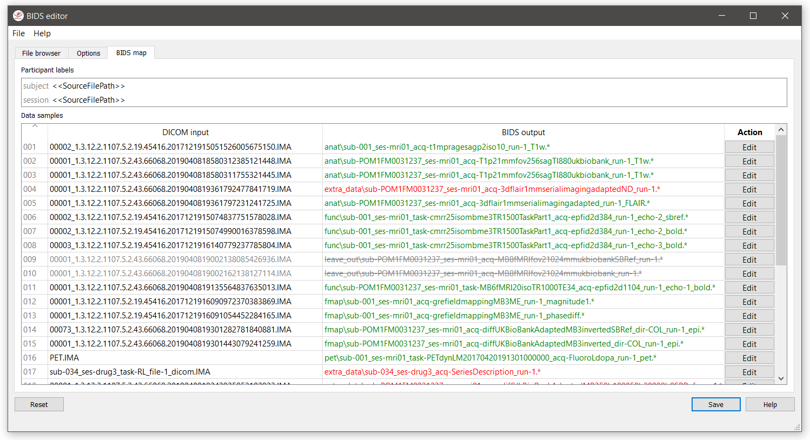
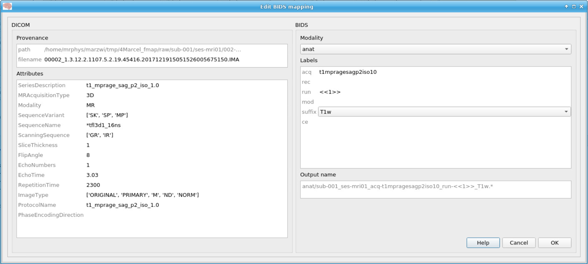

# BIDScoin


[](https://badge.fury.io/py/bidscoin)


- [The BIDScoin workflow](#the-bidscoin-workflow)
  * [Required source data structure](#required-source-data-structure)
  * [Coining your source data to BIDS](#coining-your-source-data-to-bids)
    + [Step 1a: Running the bidsmapper](#step-1a-running-the-bidsmapper)
    + [Step 1b: Running the bidseditor](#step-1b-running-the-bidseditor)
    + [Step 2: Running the bidscoiner](#step-2-running-the-bidscoiner)
  * [Finishing up](#finishing-up)
- [Plug-in functions](#options-and-plug-in-functions)
- [BIDScoin functionality / TODO](#bidscoin-functionality--todo)
- [BIDScoin tutorial](#bidscoin-tutorial)

BIDScoin is a user friendly [open-source](https://github.com/Donders-Institute/bidscoin) python toolkit that converts ("coins") source-level (raw) neuroimaging data-sets to [nifti](https://nifti.nimh.nih.gov/) / [json](https://www.json.org/) / [tsv](https://en.wikipedia.org/wiki/Tab-separated_values) data-sets that are organized following the Brain Imaging Data Structure, a.k.a. [BIDS](http://bids.neuroimaging.io) standard. Rather then depending on complex or ambiguous programmatic logic for the identification of imaging modalities, BIDScoin uses a direct mapping approach to identify and convert the raw source data into BIDS data. The information sources that can be used to map the source data to BIDS are:

1. Information in MRI header files (DICOM, PAR/REC or .7 format; e.g. SeriesDescription)
2. Information from nifti headers (e.g. image dimensionality)
3. Information in the file structure (file- and/or directory names, e.g. number of files)

> NB: Currently, the DICOM support (option 1) has been fully implemented, but the support for option 2 and 3 is planned for [future](#bidscoin-functionality--todo) releases.

The mapping information is stored as key-value pairs in the human readable and widely supported [YAML](http://yaml.org/) files. The nifti- and json-files are generated with [dcm2niix](https://github.com/rordenlab/dcm2niix). In addition, users can provide custom written [plug-in functions](#options-and-plug-in-functions), e.g. for using additional sources of information or e.g. for parsing of Presentation logfiles.

Because all the mapping information can be edited with a graphical user interface, BIDScoin requires no programming knowledge in order to use it.

For information on the BIDScoin installation and requirements, see the [installation guide](./docs/installation.md).
 
## The BIDScoin workflow

### Required source data structure
BIDScoin will take your (raw) source data as well as a YAML file with the key-value mapping (dictionary) information as input, and returns a BIDS folder as output. The source data input folder should be organised according to a `/sub-identifier/[ses-identifier]/seriesfolder/dicomfile` structure. This data organization is how users receive their data from the (Siemens) scanners at the [DCCN](https://www.ru.nl/donders/) (NB: the `ses-identifier` sub-folder is optional and can be left out).

- If your data is not already organized in this way, you can use the handy [dicomsort](./bidscoin/dicomsort.py) command-line utility to move your unordered or DICOMDIR ordered DICOM-files into a `seriesfolder` organization with the DICOM series-folders being named [SeriesNumber]-[SeriesDescription]. Series folders contain a single data type and are typically acquired in a single run.
 
- Another command-line utility that can be helpful in organizing your source data is [rawmapper](./bidscoin/rawmapper.py). This utility can show you the overview (map) of all the values of DICOM-fields of interest in your data-set and, optionally, use these fields to rename your source data sub-folders (this can be handy e.g. if you manually entered subject-identifiers as [Additional info] at the scanner console and you want to use these to rename your subject folders).
 
> If these utilities do not satisfy your needs, then have a look at this [reorganize_dicom_files](https://github.com/robertoostenveld/bids-tools/blob/master/doc/reorganize_dicom_files.md) tool.

### Coining your source data to BIDS
Having an organized source data folder, the actual data-set conversion to BIDS is performed by the [(1a)](#step-1a-running-the-bidsmapper) the `bidsmapper`, [(1b)](#step-1b-running-the-bidseditor) the `bidseditor` and [(2)](#step-2-running-the-bidscoiner) the `bidscoiner` command-line tools. The `bidsmapper` makes a map of the different kind of datatypes in your source dataset, with the `bidseditor` you can edit this map, and the `bidscoiner` does the actual work to convert the source data into BIDS. By default (but see the `-i` option of the bidsmapper below), step 1a automatically launches step 1b, so in it's simplest form, all you need to do to convert your raw source data into BIDS is to run two simple commands, e.g.:

    bidsmapper sourcefolder bidsfolder
    bidscoiner sourcefolder bidsfolder

#### Step 1a: Running the bidsmapper

    usage: bidsmapper [-h] [-b BIDSMAP] [-t TEMPLATE] [-n SUBPREFIX]
                      [-m SESPREFIX] [-i {0,1,2}] [-v]
                      sourcefolder bidsfolder
    
    Creates a bidsmap.yaml YAML file in the bidsfolder/code/bidscoin that maps the information
    from all raw source data to the BIDS labels. You can check and edit the bidsmap file with
    the bidseditor (but also with any text-editor) before passing it to the bidscoiner
    N.B.: Institute users may want to use a site-customized template bidsmap (see the
    --template option). The bidsmap_dccn template from the Donders Institute can serve as
    an example (or may even mostly work for other institutes out of the box).
    
    positional arguments:
      sourcefolder          The source folder containing the raw data in
                            sub-#/ses-#/run format (or specify --subprefix and
                            --sesprefix for different prefixes)
      bidsfolder            The destination folder with the (future) bids data and
                            the bidsfolder/code/bidscoin/bidsmap.yaml output file
    
    optional arguments:
      -h, --help            show this help message and exit
      -b BIDSMAP, --bidsmap BIDSMAP
                            The bidsmap YAML-file with the study heuristics. If
                            the bidsmap filename is relative (i.e. no "/" in the
                            name) then it is assumed to be located in
                            bidsfolder/code/bidscoin. Default: bidsmap.yaml
      -t TEMPLATE, --template TEMPLATE
                            The bidsmap template with the default heuristics (this
                            could be provided by your institute). If the bidsmap
                            filename is relative (i.e. no "/" in the name) then it
                            is assumed to be located in bidsfolder/code/bidscoin.
                            Default: bidsmap_template.yaml
      -n SUBPREFIX, --subprefix SUBPREFIX
                            The prefix common for all the source subject-folders.
                            Default: 'sub-'
      -m SESPREFIX, --sesprefix SESPREFIX
                            The prefix common for all the source session-folders.
                            Default: 'ses-'
      -i {0,1,2}, --interactive {0,1,2}
                            {0}: The sourcefolder is scanned for different kinds
                            of scans without any user interaction. {1}: The
                            sourcefolder is scanned for different kinds of scans
                            and, when finished, the resulting bidsmap is opened
                            using the bidseditor. {2}: As {1}, except that already
                            during scanning the user is asked for help if a new
                            and unknown run is encountered. This option is most
                            useful when re-running the bidsmapper (e.g. when the
                            scan protocol was changed since last running the
                            bidsmapper). Default: 1
      -v, --version         Show the BIDS and BIDScoin version
    
    examples:
      bidsmapper /project/foo/raw /project/foo/bids
      bidsmapper /project/foo/raw /project/foo/bids -t bidsmap_dccn

The bidsmapper will scan your `sourcefolder` to look for different runs (scan-types) to create a mapping for each run to a bids output name (a.k.a. the 'bidsmap'). By default (but see the `-i` option above), when finished the bidsmapper will automatically launch [step 1b](#step-1b-running-the-bidseditor), as described in the next section (but step 1b can also always be run separately by directly running the bidseditor).

> Tip: use the `-t bidsmap_dccn` option and see if it works for you. If not, consider opening it with a text editor and adapt it to your needs.

#### Step 1b: Running the bidseditor

    usage: bidseditor [-h] [-s SOURCEFOLDER] [-b BIDSMAP] [-t TEMPLATE]
                      [-n SUBPREFIX] [-m SESPREFIX]
                      bidsfolder
    
    This tool launches a graphical user interface for editing the bidsmap.yaml file
    that is e.g. produced by the bidsmapper or by this bidseditor itself. The user can
    fill in or change the BIDS labels for entries that are unidentified or sub-optimal,
    such that meaningful BIDS output names will be generated from these labels. The saved
    bidsmap.yaml output file can be used for converting the source data to BIDS using
    the bidscoiner.
    
    positional arguments:
      bidsfolder            The destination folder with the (future) bids data
    
    optional arguments:
      -h, --help            show this help message and exit
      -s SOURCEFOLDER, --sourcefolder SOURCEFOLDER
                            The source folder containing the raw data. If empty,
                            it is derived from the bidsmap provenance information
      -b BIDSMAP, --bidsmap BIDSMAP
                            The bidsmap YAML-file with the study heuristics. If
                            the bidsmap filename is relative (i.e. no "/" in the
                            name) then it is assumed to be located in
                            bidsfolder/code/bidscoin. Default: bidsmap.yaml
      -t TEMPLATE, --template TEMPLATE
                            The bidsmap template with the default heuristics (this
                            could be provided by your institute). If the bidsmap
                            filename is relative (i.e. no "/" in the name) then it
                            is assumed to be located in bidsfolder/code/bidscoin.
                            Default: bidsmap_template.yaml
      -n SUBPREFIX, --subprefix SUBPREFIX
                            The prefix common for all the source subject-folders.
                            Default: 'sub-'
      -m SESPREFIX, --sesprefix SESPREFIX
                            The prefix common for all the source session-folders.
                            Default: 'ses-'
    
    examples:
      bidseditor /project/foo/bids
      bidseditor /project/foo/bids -t bidsmap_dccn.yaml
      bidseditor /project/foo/bids -b my/custom/bidsmap.yaml
    
    Here are a few tips & tricks:
    -----------------------------
    
    DICOM Attributes
      An (DICOM) attribute label can also be a list, in which case the BIDS labels / mapping
      are applies if a (DICOM) attribute value is in this list. If the attribute value is
      empty it is not used to identify the run. Wildcards can also be given, either as a single
      '*', or enclosed by '*'. Examples:
           SequenceName: '*'
           SequenceName: '*epfid*'
           SequenceName: ['epfid2d1rs', 'fm2d2r']
           SequenceName: ['*epfid*', 'fm2d2r']
       NB: Editing the DICOM attributes is normally not necessary and adviced against
    
    Dynamic BIDS labels
      The BIDS labels can be static, in which case the label is just a normal string, or dynamic,
      when the string is enclosed with pointy brackets like `<attribute name>` or
      `<<argument1><argument2>>`. In case of single pointy brackets the label will be replaced
      during bidsmapper, bidseditor and bidscoiner runtime by the value of the (DICOM) attribute
      with that name. In case of double pointy brackets, the label will be updated for each
      subject/session during bidscoiner runtime. For instance, then the `run` label `<<1>>` in
      the bids name will be replaced with `1` or increased to `2` if a file with runindex `1`
      already exists in that directory.
    
    Fieldmaps: suffix
      Select 'magnitude1' if you have 'magnitude1' and 'magnitude2' data in one series-folder
      (this is what Siemens does) -- the bidscoiner will automatically pick up the 'magnitude2'
      data during runtime. The same holds for 'phase1' and 'phase2' data. See the BIDS
      specification for more details on fieldmap suffixes
    
    Fieldmaps: IntendedFor
      You can use the `IntendedFor` field to indicate for which runs (DICOM series) a fieldmap
      was intended. The dynamic label of the `IntendedFor` field can be a list of string patterns
      that is used to include all runs in a session that have that string pattern in their BIDS
      file name. Example: use `<<task>>` to include all functional runs or `<<Stop*Go><Reward>>`
      to include "Stop1Go"-, "Stop2Go"- and "Reward"-runs.
      NB: The fieldmap might not be used at all if this field is left empty!
    
    Manual editing / inspection of the bidsmap
      You can of course also directly edit or inspect the `bidsmap.yaml` file yourself with any
      text editor. For instance to merge a set of runs that by adding a wildcard to a DICOM
      attribute in one run item and then remove the other runs in the set. See ./docs/bidsmap.md
      and ./heuristics/bidsmap_dccn.yaml for more information.

As shown below, the main window of the bidseditor opens with the `BIDS map` tab that contains a list of `input samples` that uniquely represents all the different files that are present in the source folder, together with the associated `BIDS output name`. The path in the `BIDS output name` is shown in red if the modality is not part of the BIDS standard, striked-out gray when the runs will be ignored in the conversion to BIDS, otherwise it is colored green. Double clicking the sample (DICOM) filename opens an inspection window with the full header information (double clicking sample filenames works throughout the GUI).

<a name="bidseditor-main"></a>

The user can click the `Edit` button for each list item to open a new edit window, as show below. In this interface, the right BIDS `Modality` (drop down menu) and the `suffix` label (drop down menu) can set correctly, after which the associated BIDS `Labels` can be edited (double click black items). As a result, the new BIDS `Output name` is then shown in the bottom text field. This is how the BIDS output data will look like and, if this looks all fine, the user can store this mapping to the bidsmap and return to the main window by clicking the `OK` button.

<a name="bidseditor-edit"></a>

Finally, if all BIDS output names in the main window are fine, the user can click on the `Save` button and proceed with running the bidscoiner tool.

#### Step 2: Running the bidscoiner

    usage: bidscoiner [-h] [-p PARTICIPANT_LABEL [PARTICIPANT_LABEL ...]] [-f]
                      [-s] [-b BIDSMAP] [-n SUBPREFIX] [-m SESPREFIX] [-v]
                      sourcefolder bidsfolder
    
    Converts ("coins") datasets in the sourcefolder to nifti / json / tsv datasets in the
    bidsfolder according to the BIDS standard. Check and edit the bidsmap.yaml file to
    your needs using the bidseditor tool before running this function. You can run
    bidscoiner after all data is collected, or run / re-run it whenever new data has
    been added to the source folder (presuming the scan protocol hasn't changed). If you
    delete a (subject/) session folder from the bidsfolder, it will be re-created from the
    sourcefolder the next time you run the bidscoiner.
    
    Provenance information, warnings and error messages are stored in the
    bidsfolder/code/bidscoin/bidscoiner.log file.
    
    positional arguments:
      sourcefolder          The source folder containing the raw data in
                            sub-#/[ses-#]/run format (or specify --subprefix and
                            --sesprefix for different prefixes)
      bidsfolder            The destination / output folder with the bids data
    
    optional arguments:
      -h, --help            show this help message and exit
      -p PARTICIPANT_LABEL [PARTICIPANT_LABEL ...], --participant_label PARTICIPANT_LABEL [PARTICIPANT_LABEL ...]
                            Space seperated list of selected sub-# names / folders
                            to be processed (the sub- prefix can be removed).
                            Otherwise all subjects in the sourcefolder will be
                            selected
      -f, --force           If this flag is given subjects will be processed,
                            regardless of existing folders in the bidsfolder.
                            Otherwise existing folders will be skipped
      -s, --skip_participants
                            If this flag is given those subjects that are in
                            particpants.tsv will not be processed (also when the
                            --force flag is given). Otherwise the participants.tsv
                            table is ignored
      -b BIDSMAP, --bidsmap BIDSMAP
                            The bidsmap YAML-file with the study heuristics. If
                            the bidsmap filename is relative (i.e. no "/" in the
                            name) then it is assumed to be located in
                            bidsfolder/code/bidscoin. Default: bidsmap.yaml
      -n SUBPREFIX, --subprefix SUBPREFIX
                            The prefix common for all the source subject-folders.
                            Default: 'sub-'
      -m SESPREFIX, --sesprefix SESPREFIX
                            The prefix common for all the source session-folders.
                            Default: 'ses-'
      -v, --version         Show the BIDS and BIDScoin version
    
    examples:
      bidscoiner /project/foo/raw /project/foo/bids
      bidscoiner -f /project/foo/raw /project/foo/bids -p sub-009 sub-030

### Finishing up

After a successful run of `bidscoiner`, the work to convert your data in a fully compliant BIDS dataset is unfortunately not yet fully over and, depending on the complexity of your data-set, additional tools may need to be run and meta-data may need to be entered manually (not everything can be automated). For instance, you should update the content of the `dataset_description.json` and `README` files in your bids folder and you may need to provide e.g. additional `*_scans.tsv`,`*_sessions.tsv` or `participants.json` files (see the [BIDS specification](http://bids.neuroimaging.io/bids_spec.pdf) for more information). Moreover, if you have behavioural log-files you will find that BIDScoin does not (yet) [support](#bidscoin-functionality--todo) converting these into BIDS compliant `*_events.tsv/json` files (advanced users are encouraged to use the `bidscoiner` [plug-in](#options-and-plug-in-functions) possibility and write their own log-file parser).

If all of the above work is done, you can (and should) run the web-based [bidsvalidator](https://bids-standard.github.io/bids-validator/) to check for inconsistencies or missing files in your bids data-set (NB: the bidsvalidator also exists as a [command-line tool](https://github.com/bids-standard/bids-validator)).

> NB: The provenance of the produced BIDS data-sets is stored in the `bids/code/bidscoin/bidscoiner.log` file. This file is also very useful for debugging / tracking down bidsmapping issues.

## Options and plug-in functions
BIDScoin provides the possibility for researchers to write custom python functions that will be executed at bidsmapper and bidscoiner runtime. To use this functionality, enter the name of the module (default location is the plugins-folder; otherwise the full path must be provided) in the bidsmap dictionary file to import the plugin functions. The functions in the module should be named `bidsmapper_plugin` for bidsmapper and `bidscoiner_plugin` for bidscoiner. See [README.py](./bidscoin/plugins/README.py) for more details and placeholder code.

## BIDScoin functionality / TODO
- [x] DICOM source data
- [ ] PAR / REC source data
- [ ] P7 source data
- [ ] Nifti source data
- [x] Fieldmaps
- [x] Multi-echo data
- [x] Multi-coil data
- [x] PET data
- [ ] Stimulus / behavioural logfiles

> Are you a python programmer with an interest in BIDS who knows all about GE and / or Philips data? Are you experienced with parsing stimulus presentation log-files? Or do you have ideas to improve the this toolkit or its documentation? Have you come across bugs? Then you are highly encouraged to provide feedback or contribute to this project on [https://github.com/Donders-Institute/bidscoin](https://github.com/Donders-Institute/bidscoin).

## BIDScoin tutorial
This tutorial is specific for researchers from the DCCN and makes use of data-sets stored on its central file-system. However, it should not be difficult to use (at least part of) this tutorial for other data-sets as well.

1. **Preparation.** Activate the bidscoin environment and create a tutorial playground folder in your home directory by executing these bash commands (see also `module help bidscoin`):
   ```
   module add bidscoin  
   source activate /opt/bidscoin  
   cp -r /opt/bidscoin/tutorial ~
   ```
   The new `tutorial` folder contains a `raw` source-data folder and a `bids_ref` reference BIDS folder, i.e. the end product of this tutorial.
   
   Let's begin with inspecting this new raw data collection: 
   - Are the DICOM files for all the sub-*/ses-* folders organised in series-subfolders (e.g. sub-001/ses-01/003-T1MPRAGE/0001.dcm etc)? Use `dicomsort` if not
   - Use the `rawmapper` command to print out the DICOM values of the "EchoTime", "Sex" and "AcquisitionDate" of the fMRI series in the `raw` folder

2. **BIDS mapping.** Scan all folders in the raw data collection for unknown data by running the [bidsmapper](#step-1a-running-the-bidsmapper) bash command:  
   ```
   bidsmapper raw bids
   ```
   - Rename the "task_label" of the functional scans into something more readable, e.g. "Reward" and "Stop"
   - Add a search pattern to the IntendedFor field such that it will select your fMRI runs (see the [bidseditor](#step-1b-running-the-bidseditor) `fieldmap` section for more details)
   - When all done, (re)open the `bidsmap.yaml` file and change the options such that you will get non-zipped nifti data (i.e. `*.nii `instead of `*.nii.gz`) in your BIDS data collection. You can use a text editor or, much better, run the [bidseditor](#step-1b-running-the-bidseditor) command line tool.

3. **BIDS coining.** Convert your raw data collection into a BIDS collection by running the [bidscoiner](#step-2-running-the-bidscoiner) commandline tool (note that the input is the same as for the bidsmapper):
   ```
   bidscoiner raw bids
   ```
   - Check your `bids/code/bidscoin/bidscoiner.log` and `bids/code/bidscoin/bidscoiner.errors` files for any errors or warnings
   - Compare the results in your `bids/sub-*` subject folders with the  in `bids_ref` reference result. Are the file and foldernames the same? Also check the json sidecar files of the fieldmaps. Do they have the right "EchoTime" and "IntendedFor" fields?
   - What happens if you re-run the `bidscoiner` command? Are the same subjects processed again? Re-run "sub-001".
   - Inspect the `bids/participants.tsv` file and decide if it is ok.
   - Update the `dataset_description.json` and `README` files in your `bids` folder
   - As a final step, run the [bids-validator](https://github.com/bids-standard/bids-validator) on your `~/bids_tutorial` folder. Are you completely ready now to share this dataset?
