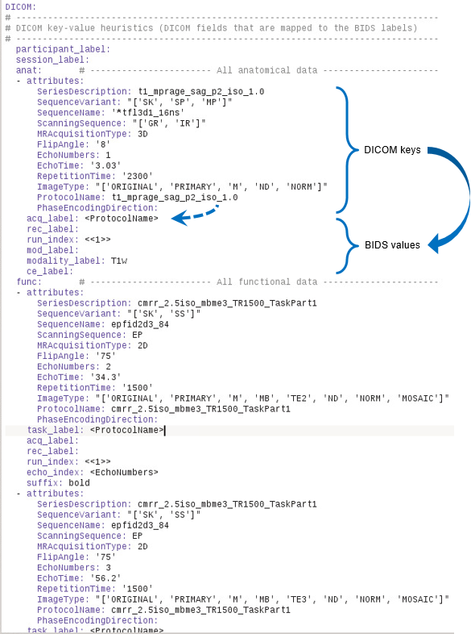

# BIDScoiner

- [The BIDScoiner workflow](#the-bidscoiner-workflow)
- [The BIDScoiner tools](#the-bidscoiner-tools)
  * [The bidstrainer](#the-bidstrainer)
  * [The bidsmapper](#the-bidsmapper)
  * [The bidscoiner](#the-bidscoiner)
- [The bidsmap files](#the-bidsmap-files)
  * [Tips and tricks](#tips-and-tricks)
    + [Attribute list](#attribute-list)
    + [Dynamic values](#dynamic-values)
    + [Field maps: IntendedFor](#field-maps-intendedfor)
    + [Plug-in functions](#plug-in-functions)
- [BIDScoiner support / TODO](#bidscoiner-support--todo)
- [BIDScoiner tutorial](#bidscoiner-tutorial)

BIDScoiner is a python commandline toolkit that converts ("coins") source-level (raw) MRI data-sets to [nifti](https://nifti.nimh.nih.gov/) / [json](https://www.json.org/) / [tsv](https://en.wikipedia.org/wiki/Tab-separated_values) data-sets that are organized according to the Brain Imaging Data Standard, a.k.a. [BIDS](http://bids.neuroimaging.io). Rather then depending on logic, BIDScoiner uses a simple (but powerful) key-value approach to convert the raw source data into BIDS data. The key values that can be used in BIDScoiner to map the data are:

 1. Information in the MRI header files (DICOM, PAR/REC or .7 format, e.g. SeriesDescription)
 2. Information from nifti headers (e.g. image dimensionality)
 3. Information in the file structure (file- and/or directory names, e.g. number of files)

The key-value heuristics are stored in flexible, human readable and broadly supported [YAML](http://yaml.org/) files. The nifti- and json-files are generated with [dcm2niix](https://github.com/rordenlab/dcm2niix).

Currently, BIDScoiner is quite functional, although only option (1) has been [implemented](#bidscoiner-support--todo) for DICOM. (NB: Options (2) and (3) are planned for future versions, such that (3) takes precedence over (2), which in turn takes precedence over (1)).

BIDScoiner is a user friendly toolkit that requires no programming knowledge in order to use it, just some basic file handling and, possibly, minor (YAML) text editing.

## The BIDScoiner workflow

BIDScoiner will take your raw data as well as a YAML file with the key-value mapping information as input, and returns a BIDS folder as output. Here is how to prepare the BIDScoiner inputs:

 1. **A minimally organised raw data folder**, following a
 `/raw/sub-[identifier]/ses-[identifier]/[seriesfolder]/[dicomfile]`
 structure. This data organization is how users receive their data from the (Siemens) scanners at the [DCCN](https://www.ru.nl/donders/) (NB: the `ses-[identifier]` sub-folder is optional and can be left out).

    If your data is not already organized in this way, you can use the `dicomsort.py` command-line utility to move your unordered dicom-files into a `seriesfolder` organization with the series folders being named [SeriesNumber]-[SeriesDescription].
 
    Another command-line utility that can be helpful in organizing your raw data is `rawmapper.py`. This utility can show you the overview (map) of all the values of dicom-fields of interest in your data-set and, optionally, use these fields to rename your raw data sub-folders (this can be handy e.g. if you manually entered subject-identifiers as [Additional info] at the scanner console and you want to use these to rename your subject folders).
 
    If these utilities do not satisfy your needs, then have a look at this more elaborate [reorganize_dicom_files](https://github.com/robertoostenveld/bids-tools/blob/master/doc/reorganize_dicom_files.md) tool.

 2. **A YAML file with the key-value mapping information, i.e. a bidsmap**.  There are two ways to create such a [bidsmap](#the-bidsmap-files).

    The first is if you are a new user and are working from scratch. In this case you would start with the `bidstrainer.py` command-line tool (see the [BIDScoiner workflow](#bidscoiner-workflow) diagram and [the bidstrainer](#the-bidstrainer) section).

    If you have run the bidstrainer or, e.g. if you work in an institute where someone else (i.e. your MR physicist ;-)) has already performed the training procedure, you can use the training data to map all the files in your data-set with the `bidsmapper.py` command-line tool (see [the bidsmapper](#the-bidsmapper) section).

    The output of the bidsmapper is the complete bidsmap that you can inspect to see if your raw data will be correctly mapped onto BIDS. If this is not the case you can go back to the training procedure and change or add new samples, and rerun the bidstrainer and bidsmapper until you have a suitable bidsmap. Alternatively, or in addition to, you can directly edit the bidsmap yourself (this requires more expert knowledge but can also be more powerful). 

    <a name="bidscoiner-workflow"></a>  
    *BIDScoiner workflow. Left: New users would start with the bidstrainer, which output can be fed into the bidsmapper to produce the bidsmap.yaml file. This file can (and should) be inspected and, in case of incorrect mappings, inform the user to add raw training samples and re-run the training procedure (dashed arrowlines). Right: Institute users could start with an institute provided bidsmap file (e.g. bidsmap_dccn.yaml) and directly use the bidsmapper. In case of incorrect mappings they could ask the institute for an updated bidsmap (dashed arrowline).*

Having an organized raw data folder and a correct bidsmap, the actual data-set conversion to BIDS can now be performed fully automatically by simply running the `bidscoiner.py` command-line tool (see the [BIDScoiner workflow](#bidscoiner-workflow) diagram and [the bidscoiner](#the-bidscoiner) section).

## The BIDScoiner tools

### The bidstrainer

    usage: bidstrainer.py [-h] bidsfolder [samplefolder] [bidsmap]
    
    Takes example files from the samples folder as training data and creates a key-value
    mapping, i.e. a bidsmap_sample.yaml file, by associating the file attributes with the
    file's BIDS-semantic pathname
    
    positional arguments:
      bidsfolder    The destination folder with the bids data structure
      samplefolder  The root folder of the directory tree containing the sample
                    files / training data. Optional argument, if left empty,
                    bidsfolder/code/samples is used or such an empty directory
                    tree is created
      bidsmap       The bidsmap yaml-file with the BIDS heuristics (optional
                    argument, default: ./heuristics/bidsmap_template.yaml)
    
    optional arguments:
      -h, --help    show this help message and exit
    
    examples:
      bidstrainer.py /project/foo/bids
      bidstrainer.py /project/foo/bids /project/foo/samples bidsmap_custom

The core idea of the bidstrainer is that you know your own scan protocol and can therefore point out which files should go where in the BIDS. In order to do so, you have to place raw sample files for each of the scan modalities / series in your protocol (e.g. T1, fMRI, etc) in the appropriate folder of a semantic folder tree (named `samples`, see the [bidstrainer example](#bidstrainer-example)). If you run `bidstrainer.py` with just the name of your bidsfolder, bidstrainer will create this semantic folder tree for you in the `code` subfolder (if it is not already there). Generally, when placing your sample files, it will be fairly straightforward to find your way in this semantic folder tree, but in doubt you should have a look at the [BIDS specification](http://bids.neuroimaging.io/bids_spec.pdf). Note that the deepest foldername in the tree denotes the BIDS suffix (e.g. "T1w").

If all sample files have been put in the appropriate location, you can (re)run the bidstrainer to create a bidsmap file for your study. How this works is that the bidstrainer will read a predefined set of (e.g. key dicom) attributes from your sample files that uniquely identify the particular scan sequence and, on the other, take the path-names of the sample files to infer the associated BIDS modality labels. In this way, a unique key-value mapping is defined that can be used as input for the [bidsmapper tool](#the-bidsmapper). If this mapping is not unique (not likely but possible), or if you prefer to use more or other attributes than the predefined ones, you can (copy and) edit the [bidsmap_template.yaml](./heuristics/bidsmap_template.yaml) file in the heuristics folder and re-run the bidstrainer whith this customized template as an input argument.

<a name="bidstrainer-example"></a>
*Bidstrainer example. The red arrow depicts a raw data sample (left file browser) that is put (copied over) to the appropriate location in the semantic folder tree (right file browser)*

### The bidsmapper

    usage: bidsmapper.py [-h] [-a] rawfolder bidsfolder [bidsmap]
    
    Creates a bidsmap.yaml YAML file that maps the information from all raw data to the
    BIDS labels (see also [bidsmap_template.yaml] and [bidstrainer.py]). You can check
    and edit the bidsmap.yaml file before passing it to [bidscoiner.py]
    
    positional arguments:
      rawfolder        The source folder containing the raw data in
                       sub-#/ses-#/series format
      bidsfolder       The destination folder with the bids data structure
      bidsmap          The bidsmap yaml-file with the BIDS heuristics (optional
                       argument, default: bidsfolder/code/bidsmap_sample.yaml)
    
    optional arguments:
      -h, --help       show this help message and exit
      -a, --automatic  If this flag is given the user will not be asked for help
                       if an unknown series is encountered
    
    examples:
      bidsmapper.py /project/foo/raw /project/foo/bids
      bidsmapper.py /project/foo/raw /project/foo/bids bidsmap_dccn

The `bidsmapper.py` tool goes over all raw data folders of your dataset and saves the known and unknown key-value mappings in a (study specific) [bidsmap file](#the-bidsmap-files). You can consider it as a dry-run for how exactly the [bidscoiner](#the-bidscoiner) will convert the raw data into BIDS folders. It gives you the opportunity to inspect the resulting `bidsmap.yaml` file to see if all scan series were recognized correctly with proper BIDS labels before doing the actual conversion to BIDS. Unexpected mappings or poor BIDS labels can be found if your bidstraining or the bidsmap file that was provided to you was incomplete. In that case you should either get an updated bidsmap file or redo the bidstraining with new sample files, rerun the bidstrainer and bidsmapper until you have a suitable `bidsmap.yaml` file. You can of course also directly edit the `bidsmap.yaml` file yourself, for instance by changing some of the automatically generated BIDS labels to your needs (e.g. "task_label").

### The bidscoiner

    usage: bidscoiner.py [-h] [-s [SUBJECTS [SUBJECTS ...]]] [-f] [-p]
                         [-b BIDSMAP]
                         rawfolder bidsfolder
    
    Converts ("coins") datasets in the rawfolder to nifti / json / tsv datasets in the
    bidsfolder according to the BIDS standard. Check and edit the bidsmap.yaml file to
    your needs before running this function. Provenance, warnings and error messages are
    stored in the ../bidsfolder/code/bidscoiner.log file
    
    positional arguments:
      rawfolder             The source folder containing the raw data in
                            sub-#/ses-#/series format
      bidsfolder            The destination folder with the bids data structure
    
    optional arguments:
      -h, --help            show this help message and exit
      -s [SUBJECTS [SUBJECTS ...]], --subjects [SUBJECTS [SUBJECTS ...]]
                            Space seperated list of selected sub-# names / folders
                            to be processed. Otherwise all subjects in the
                            rawfolder will be selected
      -f, --force           If this flag is given subjects will be processed,
                            regardless of existing folders in the bidsfolder.
                            Otherwise existing folders will be skipped
      -p, --participants    If this flag is given those subjects that are in
                            particpants.tsv will not be processed (also when the
                            --force flag is given). Otherwise the participants.tsv
                            table is ignored
      -b BIDSMAP, --bidsmap BIDSMAP
                            The bidsmap yaml-file with the study heuristics. If
                            the bidsmapfile is relative (i.e. no "/" in the name)
                            then it is assumed to be located in bidsfolder/code/.
                            Default: bidsmap.yaml
    
    examples:
      bidscoiner.py /project/raw /project/bids
      bidscoiner.py -f /project/raw /project/bids -s sub-009 sub-030

The `bidscoiner.py` tool is the workhorse of the toolkit that will fully automatically convert your source-level (raw) MRI data-sets to BIDS organized data-sets. You can run this tool after all data is collected, or whenever new data has been added to the raw folder.

After a successful run of bidscoiner, you can (and should) run the web-based [bidsvalidator](https://incf.github.io/bids-validator/) to check for inconsistencies or missing files in your bids data-set or use a [command-line version](https://github.com/INCF/bids-validator). For instance, if you have behavioural log-files you will find that the bidscoiner tool does not (yet) support converting these into BIDS compliant *_events.tsv/json files. Advanced users are encouraged to use the bidscoiner plug-in possibility and write their own log-file parser (undocumented feature, don't be afraid to ask for help).

NB: The provenance of the produced BIDS data-sets is stored in the `bids/code/bidscoiner.log` file. This file is also very useful for debugging / tracking down bidsmapping issues.

## The bidsmap files

A bidsmap file contains a collection of key-value dictionaries that define unique mappings between different types of raw data files (e.g. DICOM series) and their corresponding BIDS labels. As bidsmap files are both inputs as well as outputs for the different BIDScoiner tools (except for `bidscoiner.py`, which has BIDS data as output; see the [BIDScoiner workflow](#bidscoiner-workflow)), they are derivatives of eachother and, as such, share the same basic structure. The [bidsmap_template.yaml](./heuristics/bidsmap_template.yaml) file is relatively empty and defines only which attributes (but not their values) are mapped to which BIDS-labels. The [bidsmap_[sample/site].yaml](#bidsmap-sample) file contains actual attribute values (e.g. from training samples from a certain study or site) and their associated BIDS-values. The final [bidsmap.yaml](./heuristics) file contains the attribute and associated BIDS values for all types of data found in entire raw data collection.

A bidsmap file consists of help-text, followed by several mapping sections, i.e. Options, DICOM, PAR, P7, Nifti, FileSystem and Plugin. Within each of these sections there different sub-sections for the different BIDS modalities, i.e. for anat, func, dwi, fmap and beh. There are a few additional sections, i.e. participant_label, session_label and extra_data. Schematically, a bidsmap file has the following structure:

 - **Options** *(A list of general options that can be passed to the bidscoiner and its plug-ins)*
 - **DICOM**
   - participant_label [a DICOM field]
   - session_label [a DICOM field]
   - anat
     - attributes
       - [a DICOM field]
       - [another DICOM field]
       - [..]
     - acq_label
     - rec_label
     - run_index
     - mod_label
     - modality_label
     - ce_label
   - func
     - attributes
       - [a DICOM field]
       - [another DICOM field]
       - [..]
     - task_label
     - acq_label
     - [..]
   - dwi
     - [..]
   - fmap
     - [..]
   - beh
     - [..]
   - extra_data *(all non-BIDS data)*
     - [..]
 - **PAR**.
 - **P7**.
 - **Nifti**.
 - **FileSystem**.
 - **PlugIn**. Name of the python plug-in function. Supported but this is an experimental (untested) feature

Inside each BIDS modality, there can be multiple key-value mappings that map (e.g. DICOM) modality [attributes] to the BIDS [labels] (e.g. "task_label"), as indicated below:



*Bidsmap_sample example. As indicated by the solid arrowline, the set of DICOM values (suitable to uniquely identify the dicom series) are used here a key-set that maps onto the set of BIDS labels. Note that certain BIDS labels are enclosed by pointy brackets, marking their [dynamic value](#dynamic-values). In this bidsmap, as indicated by the dashed arrowline, that means that \<ProtocolName> will be replaced in a later stage by "t1_mprage_sag_p2_iso_1.0". Also note that in this bidsmap there was only one T1-image, but there where two different fMRI series (here because of multi-echo, but multiple tasks could also be listed)*

### Tips and tricks

#### Attribute list
The attribute value can also be a list, in which case a dicom series is positively identified if its attribute value is in this list.

#### Dynamic values
The BIDS labels can be static, in which case the value is just a normal string, or dynamic, when the string is enclosed with pointy brackets like \<attribute name> or \<\<argument1>\<argument2>> (see the [example](#bidsmap-sample) above). In case of single pointy brackets the value will be replaced during bidsmapper and bidscoiner runtime by the value of the attribute with that name. In case of double pointy brackets, the value will be updated for each subject/session during bidscoiner runtime (e.g. the \<\<runindex>> value will be increased if a file with the same runindex already exists in that directory).
 
#### Field maps: IntendedFor
You can use the "IntendedFor" field to indicate for which series (scans) a fieldmap was intended. The dynamic value of the "IntendedFor" field can be a list of string patterns (e.g. \<\<Stop*Go>\<RewardTask>> to include both the stop-task and reward-task series) that is used to include those series (nifti-files) that have that string pattern in their pathname.

#### Plug-in functions

WIP

## BIDScoiner support / TODO
- [x] DICOM source data
- [ ] PAR / REC source data
- [ ] P7 source data
- [ ] Nifti source data
- [x] Fieldmaps
- [x] Multi-echo data
- [x] Multi-coil data
- [ ] Stimulus / behavioural logfiles

## BIDScoiner tutorial
This tutorial is specific for researchers from the DCCN and makes use of data-sets stored on its central file-system. However, it should not be difficult to use (at least part of) this tutorial for other data-sets as well.
 
1. Activate the bidscoiner environment and create a BIDS output directory for this tutorial by using these bash commands:  
   ```
   module add anaconda3  
   source activate /opt/bidscoiner  
   PATH=/opt/bidscoiner/1.3/bidscoiner:$PATH  
   mkdir ~/bids_tutorial
   ```
   
2. Perform [training](#the-bidstrainer) on some raw data samples:
   - Create a sample foldertree in your bids output folder with this bash command:  
   ```
   bidstrainer.py ~/bids_tutorial
   ```
   - Put files in the right folders in this tree
   - Do the training by re-running the above `bidstrainer.py` command
   
3. Scan your raw data collection by running the [bidsmapper](#the-bidsmapper) bash command:  
   ```
   bidsmapper.py /opt/bidscoiner/tutorial/raw ~/bids_tutorial
   ```
   - Check the "extra_data" section in your `~/bids_tutorial/code/bidsmap.yaml` file for images that should go in the BIDS sections (e.g. T1, fMRI or DWI data). If so, add training samples and redo the training steps etc
   - Rename the "task_label" of the functional scans into something more readable, e.g. "Reward" and "Stop"
   - Add a search pattern to the [IntendedFor](#field-maps-intendedfor) field such that it will select your fMRI series
   
4. Convert your raw data collection into BIDS by running the bidscoiner bash command (note that the input is the same as for the bidsmapper):  
   ```
   bidscoiner.py /opt/bidscoiner/tutorial/raw ~/bids_tutorial
   ```
   - Check your `~/bids_tutorial/code/bidscoiner.log` file for any errors or warnings 
   - Compare your result in your `~/bids_tutorial` subject folders with the reference result in `/opt/bidscoiner/tutorial/bids`. Do the results look the same? Also check the json sidecar files of the fieldmaps. Do they have the right "EchoTime" and "IntendedFor" fields?
   - Check the `~/bids_tutorial/participants.tsv` file
   - Run the [bids-validator](https://github.com/INCF/bids-validator) on your `~/bids_tutorial` folder 
