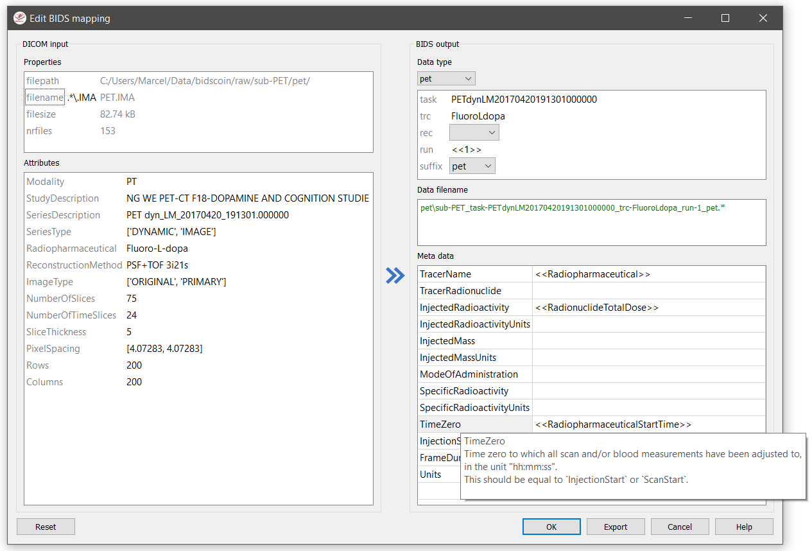

Advanced usage
==============

Customized template bidsmap
---------------------------

 The run-items in the default 'bidsmap_dccn' template bidsmap have source dictionary values that are tailored to MRI acquisitions in the Donders Institute. Hence, if you are using different protocol parameters that do not match with these template values, then your runs will initially be data (mis)typed by the bidsmapper as miscellaneous 'extra_data' -- which you then need to correct afterwards yourself. To improve that initial data typing and further automate your workflow, you may consider creating your own customized template bidsmap.

.. tip::
   Make a copy of the DCCN template (``[path_to_bidscoin]/heuristics/bidsmap_dccn.yaml``) as a starting point for your own template bidsmap, and adapt it to your environment

.. note::
   If you want to use different source attributes than the default set to identify source data types, then beware that the attribute values should not vary between different repeats of the data acquision. Otherwise the number of run-items in the bidsmap will not be a unique shortlist of the acquisition protocols in your study, but will instead become a lengthy list that is proportional to the number of subjects and sessions.

Editing the template
^^^^^^^^^^^^^^^^^^^^

1. **Using the bidseditor**. While this is certainly not recommended for most use cases, the easiest (quick and dirty) way to create a bidsmap template is to use the bidseditor GUI. If you have a run item in your study that you would like to be automatically mapped in other / future studies you can simply append that run to the standard or to a custom template bidsmap by editing it to your needs and click the [Export] button (see below). Note that you should first clear the attribute values (e.g. 'EchoTime') that vary across repeats of the same or similar acquisitions. You can still add advanced features, such as `regular expression patterns <https://docs.python.org/3/library/re.html>`__ for the attribute values. You can also open the template bidsmap itself with the bidseditor and edit it directly. The main limitation of using the GUI is that the run items are simply appended to a bidsmap template, meaning that they are last in line (for that datatype) when the bidsmapper tries to find a matching run-item. Another limitation is that with the GUI you cannot make usage of YAML anchors and references, yielding a less clearly formatted bidsmap that is harder to maintain. Both limitations are overcome when directly editing the template bidsmap yourself using a text editor (see next point).

   The edit window with the option to export the customized mapping of run a item, and featuring properties matching and dynamic meta-data values

2. **Using a text editor**. This is the adviced and most powerful way to create or modify a bidsmap template but requires more knowledge of `YAML <http://yaml.org/>`__ and more `understanding of bidsmaps <bidsmap.html>`__. To organise and empower your template you can take the DCCN template bidsmap (``[path_to_bidscoin]/heuristics/bidsmap_dccn.yaml``) as an example and work from there. If you open that template with a text editor, there are a few handy things to take notice of (as shown in the template snippet below). First, you can see that the DCCN template makes use of YAML `anchors and aliases <https://blog.daemonl.com/2016/02/yaml.html>`__ (to make maintanance more sustainable). The second thing to notice is that, of the first run, all values of the attribute dictionary are empty, meaning that it won't match any run-item. In that way, however, the subsequent runs that dereference (e.g. with ``<<: *anatattributes_dicom``) this anchor (e.g. ``&anatattributes_dicom``) will inherit only the keys and can inject their own values, as shown in the second run. The first run of each modality sub-section (like ``anat``) also serves as the default bidsmapping when users manually overrule / change the bids modality using the `bidseditor <workflow.html#step-1b-running-the-bidseditor>`__ GUI.

.. tip::
   - Run-items are matched from top to bottom. You can use this to your advantage by placing certain run-items above others
   - The power of regular expressions is nearly unlimited, you can e.g. use `negative look aheads <https://docs.python.org/3/howto/regex.html#lookahead-assertions>`__ to *not* match (exclude) certain strings
   - Use more attributes for more selective run-item matching. For instance, to distinguish an equally named SBRef DWI scan from the normal DWI scans, you can add ``DiffusionDirectionality: NONE`` to your attribute dictionary
   - When creating new run-items, make sure to adhere to the format defined in the BIDS schema files (``[path_to_bidscoin]/bidscoin/schema/datatypes``).

.. code-block:: yaml

   anat:       # ----------------------- All anatomical runs --------------------
   - provenance: ~                 # The fullpath name of the DICOM file from which the attributes are read. Serves also as a look-up key to find a run in the bidsmap
     properties: &fileattr         # This is an optional (stub) entry of filesystem matching (could be added to any run-item)
       filepath: ~                 # File folder, e.g. ".*Parkinson.*" or ".*(phantom|bottle).*"
       filename: ~                 # File name, e.g. ".*fmap.*" or ".*(fmap|field.?map|B0.?map).*"
       filesize: ~                 # File size, e.g. "2[4-6]\d MB" for matching files between 240-269 MB
       nrfiles: ~                  # Number of files in the folder that match the above criteria, e.g. "5/d/d" for matching a number between 500-599
     attributes: &anat_dicomattr   # An empty / non-matching reference dictionary that can be derefenced in other run-items of this data type
       Modality: ~
       ProtocolName: ~
       SeriesDescription: ~
       ImageType: ~
       SequenceName: ~
       SequenceVariant: ~
       ScanningSequence: ~
       MRAcquisitionType: ~
       SliceThickness: ~
       FlipAngle: ~
       EchoNumbers: ~
       EchoTime: ~
       RepetitionTime: ~
       PhaseEncodingDirection: ~
     bids: &anat_dicoment_nonparametric  # See: schema/datatypes/anat.yaml
       acq: <SeriesDescription>    # This will be expanded by the bidsmapper (so the user can edit it)
       ce: ~
       rec: ~
       run: <<1>>                  # This will be updated during bidscoiner runtime (as it depends on the already existing files)
       part: ['', 'mag', 'phase', 'real', 'imag', 0]
       suffix: T1w
     meta:                         # This is an optional entry for meta-data that will be appended to the json sidecar files produced by dcm2niix
   - provenance: ~
     properties:
       <<: *fileattr
       nrfiles: [1-3]/d/d          # Number of files in the folder that match the above criteria, e.g. "5/d/d" for matching a number between 500-599
     attributes:
       <<: *anat_dicomattr
       ProtocolName: '(?i).*(MPRAGE|T1w).*'
       MRAcquisitionType: '3D'
     bids: *anat_dicoment_nonparametric
     meta:
       Comments: <<ImageComments>>    # This will be expanded during bidscoiner runtime (as it may vary from session to session)
   - provenance: ~
     attributes:
       <<: *anat_dicomattr
       ProtocolName: '(?i).*T2w.*'
       SequenceVariant: '[''SK'', ''SP'']'       # NB: Uses a yaml single-quote escape
     bids:
       <<: *anat_dicoment_nonparametric
       suffix: T2w

*Snippet derived from the bidsmap_dccn template, showing a `DICOM` section with a void `anat` run-item and two normal run-items that dereference from the void item*

Plugins
-------

all interactions of BIDScoin routines with source data are done via a plugin layer that abstracts away differences between source data formats. The bidsmapper and bidscoiner tools loop over the subjects/sessions in your source data repository and then use the plugins listed in the bidsmap to do the actual work. A few plugins come pre-installed:

- **Dcm2niix2bids: a plugin for DICOM and PAR/XML data**. The 'dcm2niix2bids' plugin is a wrapper around the well-known pydicom, nibabel and dcm2niix tools to interact with and convert DICOM and Philips PAR(/REC)/XML source data. Pydicom is used to read DICOM attributes, nibabel is used to read PAR/XML attribute values and dcm2niix is used to convert the DICOM and PAR/XML source data to NIfTI  and create BIDS sidecar files. These sidecar files contain standard metadata but, to give more control to the user, this metadata is appended or overwritten by the data in the BIDS-mapping meta dictionary.
- **Spec2nii2bids: a plugin for MR spectroscopy data**. The 'spec2nii2bids' plugin is a wrapper around the recent spec2nii Python library to interact with and convert MR spectroscopy source data. Presently, the spec2nii2bids plugin is a first implementation that supports the conversion to BIDS for Philips SPAR/SDAT files, Siemens Twix files and GE P-files. As with the dcm2niix2bids plugin, the produced sidecar files already contain standard metadata that is complemented or overruled by the meta data that users specified in the bidseditor.
- **Phys2bidscoin: a plugin for physiological data**. The 'phys2bidscoin' plugin is a wrapper around the phys2bids Python library to interact with and convert physiological source data. Phys2bids currently supports the conversion of labchart (ADInstruments) and AcqKnowledge (BIOPAC) source files to compressed tab-separated value (``.tsv.gz``) files and create their json sidecar files, as per BIDS specifications. As in the other plugins, the sidecar files contain standard metadata that is overwritten by the user data entered in the bidseditor. This plugin has been developed during the OHBM hackathon 2021 and is still considered experimental.

Plugin programming interface
^^^^^^^^^^^^^^^^^^^^^^^^^^^^

This paragraph describes the requirements and structure of plugins in order to allow advanced users and developers to write their own plugin and extent or customize BIDScoin to their needs. As can be seen in the API code snippet below (but aso see the default plugins for reference implementation), a BIDScoin plugin is a Python module with the following programming interface (functions):

.. note:: Run the ``bidscoin`` utility to list, install or uninstall BIDScoin plugins

.. code-block:: python3

   """
   This module contains placeholder code demonstrating the bidscoin plugin API, both for the bidsmapper and for
   the bidscoiner. The functions in this module are called if the basename of this module (when located in the
   plugins-folder; otherwise the full path must be provided) is listed in the bidsmap. The presence of the
   plugin functions is optional but should be named:

   - test:                 A test function for the plugin + its bidsmap options. Can be called in the bidseditor
   - is_sourcefile:        A function to assess whether a source file is supported by the plugin. The return value should correspond to a data format section in the bidsmap
   - get_attribute:        A function to read an attribute value from a source file
   - bidsmapper_plugin:    A function to discover BIDS-mappings in a source data session. To avoid code duplications and minimize plugin development time, various support functions are available to the plugin programmer in BIDScoin's library module named 'bids'
   - bidscoiner_plugin:    A function to convert a single source data session to bids according to the specified BIDS-mappings. Various support functions are available in the 'bids' library module
   """

   import logging
   from pathlib import Path

   LOGGER = logging.getLogger(__name__)

   # The default options that are set when installing the plugin
   OPTIONS = {'command': 'demo',   # Plugin option
              'args': 'foo bar'}   # Another plugin option

   # The default bids-mappings that are added when installing the plugin
   BIDSMAP = {'DemoFormat':{
       'subject': '<<filepath:/sub-(.*?)/>>',     # This filesystem property extracts the subject label from the source directory. NB: Any property or attribute can be used as subject-label, e.g. <PatientID>
       'session': '<<filepath:/ses-(.*?)/>>',     # This filesystem property extracts the session label from the source directory. NB: Any property or attribute can be used as session-label, e.g. <StudyID>

       'func': [                   # ----------------------- All functional runs --------------------
           {'provenance': '',      # The fullpath name of the source file from which the attributes and properties are read. Serves also as a look-up key to find a run in the bidsmap
            'properties':          # The matching (regexp) criteria go in here
               {'filepath': '',    # File folder, e.g. ".*Parkinson.*" or ".*(phantom|bottle).*"
                'filename': '',    # File name, e.g. ".*fmap.*" or ".*(fmap|field.?map|B0.?map).*"
                'filesize': '',    # File size, e.g. "2[4-6]\d MB" for matching files between 240-269 MB
                'nrfiles': ''},    # Number of files in the folder that match the above criteria, e.g. "5/d/d" for matching a number between 500-599
            'attributes':          # The matching (regexp) criteria go in here
               {'ch_num': '.*',
                'filetype': '.*',
                'freq': '.*',
                'ch_name': '.*',
                'units': '.*',
                'trigger_idx': '.*'},
            'bids':
               {'task': '',
                'acq': '',
                'ce': '',
                'dir': '',
                'rec': '',
                'run': '<<1>>',    # This will be updated during bidscoiner runtime (as it depends on the already existing files)
                'recording': '',
                'suffix': 'physio'},
            'meta':                # This is an optional entry for meta-data dictionary that are appended to the json sidecar files
               {'TriggerChannel': '<<trigger_idx>>',
                'ExpectedTimepoints': '<<num_timepoints_found>>',
                'ChannelNames': '<<ch_name>>',
                'Threshold': '<<thr>>',
                'TimeOffset': '<<time_offset>>'}}],

       [...]

       'exclude': [  # ----------------------- Data that will be left out -------------
           {'provenance': '',
            'properties':
               {'filepath': '',
                'filename': '',
                'filesize': '',
                'nrfiles': ''},
            'attributes':
               {'ch_num': '.*',
                'filetype': '.*',
                'freq': '.*',
                'ch_name': '.*',
                'units': '.*',
                'trigger_idx': '.*'},
            'bids':
               {'task': '',
                'acq': '',
                'ce': '',
                'dir': '',
                'rec': '',
                'run': '<<1>>',
                'recording': '',
                'suffix': 'physio'},
            'meta':
               {'TriggerChannel': '<<trigger_idx>>',
                'ExpectedTimepoints': '<<num_timepoints_found>>',
                'ChannelNames': '<<ch_name>>',
                'Threshold': '<<thr>>',
                'TimeOffset': '<<time_offset>>'}}]}}

   def test(options: dict) -> bool:
       """
       This plugin function tests the working of the plugin + its bidsmap options

       :param options: A dictionary with the plugin options, e.g. taken from the bidsmap['Options']
       :return:        True if the test was successful
       """

       LOGGER.debug(f'This is a demo-plugin test routine, validating its working with options: {options}')

       return True

   def is_sourcefile(file: Path) -> str:
       """
       This plugin function assesses whether a sourcefile is of a supported dataformat

       :param file:    The sourcefile that is assessed
       :return:        The valid / supported dataformat of the sourcefile
       """

       if file.is_file():

           LOGGER.debug(f'This is a demo-plugin is_sourcefile routine, assessing whether "{file}" has a valid dataformat')
           return 'dataformat'

       return ''

   def get_attribute(dataformat: str, sourcefile: Path, attribute: str, options: dict) -> Union[str, int]:
       """
       This plugin function reads attributes from the supported sourcefile

       :param dataformat:  The bidsmap-dataformat of the sourcefile, e.g. DICOM of PAR
       :param sourcefile:  The sourcefile from which the attribute value should be read
       :param attribute:   The attribute key for which the value should be read
       :param options:     A dictionary with the plugin options, e.g. taken from the bidsmap['Options']
       :return:            The attribute value
       """

       if dataformat in ('DICOM','PAR'):
           LOGGER.debug(f'This is a demo-plugin get_attribute routine, reading the {dataformat} "{attribute}" attribute value from "{sourcefile}"')

       return ''

   def bidsmapper_plugin(session: Path, bidsmap_new: dict, bidsmap_old: dict, template: dict, store: dict) -> None:
       """
       All the logic to map the Philips PAR/XML fields onto bids labels go into this plugin function. The function is
       expecte to update / append new runs to the bidsmap_new data structure. The bidsmap options for this plugin can
       be found in:

       bidsmap_new/old['Options']['plugins']['README']

       See also the dcm2niix2bids plugin for reference implementation

       :param session:     The full-path name of the subject/session raw data source folder
       :param bidsmap_new: The new study bidsmap that we are building
       :param bidsmap_old: The previous study bidsmap that has precedence over the template bidsmap
       :param template:    The template bidsmap with the default heuristics
       :param store:       The paths of the source- and target-folder
       :return:
       """

       LOGGER.debug(f'This is a bidsmapper demo-plugin working on: {session}')

   def bidscoiner_plugin(session: Path, bidsmap: dict, bidsses: Path) -> None:
       """
       The plugin to convert the runs in the source folder and save them in the bids folder. Each saved datafile should be
       accompanied with a json sidecar file. The bidsmap options for this plugin can be found in:

       bidsmap_new/old['Options']['plugins']['README']

       See also the dcm2niix2bids plugin for reference implementation

       :param session:     The full-path name of the subject/session source folder
       :param bidsmap:     The full mapping heuristics from the bidsmap YAML-file
       :param bidsses:     The full-path name of the BIDS output `ses-` folder
       :return:            Nothing
       """

       LOGGER.debug(f'This is a bidscoiner demo-plugin working on: {session} -> {bidsfolder}')

*The README plugin placeholder code*
