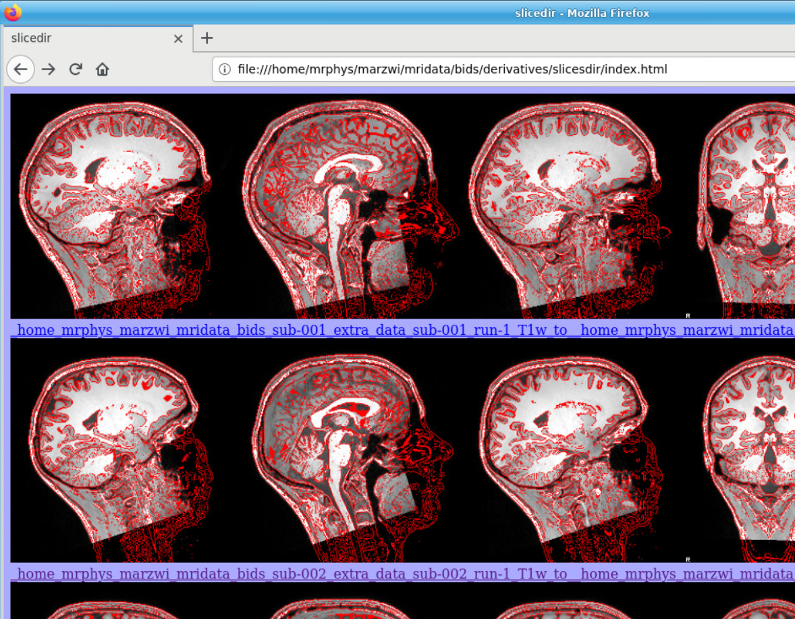

BIDS-apps
=========

Multi-echo combination
----------------------

Before sharing or pre-processing their images, users may want to combine the separate the individual echos of multi-echo MRI acquisitions. The ``echcombine``-tool is a wrapper around ``mecombine`` that writes BIDS valid output.

::

    usage: echocombine [-h] [-p PARTICIPANT_LABEL [PARTICIPANT_LABEL ...]] [-o OUTPUT]
                       [-a {PAID,TE,average}] [-w [WEIGHTS ...]] [-f]
                       bidsfolder pattern

    A wrapper around the 'mecombine' multi-echo combination tool
    (https://github.com/Donders-Institute/multiecho).

    Except for BIDS inheritances, this wrapper is BIDS-aware (a 'bidsapp') and writes BIDS
    compliant output

    positional arguments:
      bidsfolder            The bids-directory with the (multi-echo) subject data
      pattern               Globlike recursive search pattern (relative to the subject/session
                            folder) to select the first echo of the images that need to be
                            combined, e.g. '*task-*echo-1*'

    optional arguments:
      -h, --help            show this help message and exit
      -p PARTICIPANT_LABEL [PARTICIPANT_LABEL ...], --participant_label PARTICIPANT_LABEL [PARTICIPANT_LABEL ...]
                            Space separated list of sub-# identifiers to be processed (the sub-
                            prefix can be left out). If not specified then all sub-folders in the
                            bidsfolder will be processed (default: None)
      -o OUTPUT, --output OUTPUT
                            A string that determines where the output is saved. It can be the
                            name of a BIDS datatype folder, such as 'func', or of the derivatives
                            folder, i.e. 'derivatives'. If output = [the name of the input
                            datatype folder] then the original echo images are replaced by one
                            combined image. If output is left empty then the combined image is
                            saved in the input datatype folder and the original echo images are
                            moved to the extra_data folder (default: )
      -a {PAID,TE,average}, --algorithm {PAID,TE,average}
                            Combination algorithm (default: TE)
      -w [WEIGHTS ...], --weights [WEIGHTS ...]
                            Weights for each echo (default: None)
      -f, --force           If this flag is given subjects will be processed, regardless of
                            existing target files already exist. Otherwise the echo-combination
                            will be skipped (default: False)

    examples:
      echocombine myproject/bids func/*task-stroop*echo-1*
      echocombine myproject/bids *task-stroop*echo-1* -p 001 003
      echocombine myproject/bids func/*task-*echo-1* -o func
      echocombine myproject/bids func/*task-*echo-1* -o derivatives -w 13 26 39 52
      echocombine myproject/bids func/*task-*echo-1* -a PAID

Defacing
--------

Before sharing or pre-processing their images, users may want to deface their anatomical MRI acquisitions to protect the privacy of their subjects. The ``deface``-tool is a wrapper around `pydeface <https://github.com/poldracklab/pydeface>`__ that writes BIDS valid output. NB: pydeface requires `FSL <https://fsl.fmrib.ox.ac.uk/fsl/fslwiki/FslInstallation>`__ to be installed on the system.

::

    usage: deface [-h] [-p PARTICIPANT_LABEL [PARTICIPANT_LABEL ...]] [-o OUTPUT] [-c]
                  [-n NATIVESPEC] [-a ARGS] [-f]
                  bidsfolder pattern

    A wrapper around the 'pydeface' defacing tool (https://github.com/poldracklab/pydeface).

    Except for BIDS inheritances and IntendedFor usage, this wrapper is BIDS-aware (a 'bidsapp')
    and writes BIDS compliant output

    Linux users can distribute the computations to their HPC compute cluster if the DRMAA
    libraries are installed and the DRMAA_LIBRARY_PATH environment variable set

    For multi-echo data see ``medeface``

    positional arguments:
      bidsfolder            The bids-directory with the subject data
      pattern               Globlike search pattern (relative to the subject/session folder) to
                            select the images that need to be defaced, e.g. 'anat/*_T1w*'

    optional arguments:
      -h, --help            show this help message and exit
      -p PARTICIPANT_LABEL [PARTICIPANT_LABEL ...], --participant_label PARTICIPANT_LABEL [PARTICIPANT_LABEL ...]
                            Space separated list of sub-# identifiers to be processed (the sub-
                            prefix can be left out). If not specified then all sub-folders in the
                            bidsfolder will be processed (default: None)
      -o OUTPUT, --output OUTPUT
                            A string that determines where the defaced images are saved. It can
                            be the name of a BIDS datatype folder, such as 'anat', or of the
                            derivatives folder, i.e. 'derivatives'. If output is left empty then
                            the original images are replaced by the defaced images (default:
                            None)
      -c, --cluster         Flag to use the DRMAA library to submit the deface jobs to a high-
                            performance compute (HPC) cluster (default: False)
      -n NATIVESPEC, --nativespec NATIVESPEC
                            DRMAA native specifications for submitting deface jobs to the HPC
                            cluster (default: -l walltime=00:30:00,mem=2gb)
      -a ARGS, --args ARGS  Additional arguments (in dict/json-style) that are passed to
                            pydeface. See examples for usage (default: {})
      -f, --force           If this flag is given images will be processed, regardless if images
                            have already been defaced (i.e. if {"Defaced": True} in the json
                            sidecar file) (default: False)

    examples:
      deface myproject/bids anat/*_T1w*
      deface myproject/bids anat/*_T1w* -p 001 003 -o derivatives
      deface myproject/bids anat/*_T1w* -c -n "-l walltime=00:60:00,mem=4gb"
      deface myproject/bids anat/*_T1w* -a '{"cost": "corratio", "verbose": ""}'

Multi-echo defacing
-------------------

This utility is very similar to the `deface <#defacing>`__ utility above, except that it can handle multi-echo data.

::

    usage: medeface [-h] [-m MASKPATTERN] [-p PARTICIPANT_LABEL [PARTICIPANT_LABEL ...]]
                    [-o OUTPUT] [-c] [-n NATIVESPEC] [-a ARGS] [-f]
                    bidsfolder pattern

    A wrapper around the 'pydeface' defacing tool (https://github.com/poldracklab/pydeface) that
    computes a defacing mask on a (temporary) echo-combined image and then applies it to each
    individual echo-image.

    Except for BIDS inheritances and IntendedFor usage, this wrapper is BIDS-aware (a 'bidsapp')
    and writes BIDS compliant output

    Linux users can distribute the computations to their HPC compute cluster if the DRMAA
    libraries are installed and the DRMAA_LIBRARY_PATH environment variable set

    For single-echo data see ``deface``

    positional arguments:
      bidsfolder            The bids-directory with the (multi-echo) subject data
      pattern               Globlike search pattern (relative to the subject/session folder) to
                            select the images that need to be defaced, e.g. 'anat/*_T2starw*'

    optional arguments:
      -h, --help            show this help message and exit
      -m MASKPATTERN, --maskpattern MASKPATTERN
                            Globlike search pattern (relative to the subject/session folder) to
                            select the images from which the defacemask is computed, e.g.
                            'anat/*_part-mag_*_T2starw*'. If not given then 'pattern' is used
                            (default: None)
      -p PARTICIPANT_LABEL [PARTICIPANT_LABEL ...], --participant_label PARTICIPANT_LABEL [PARTICIPANT_LABEL ...]
                            Space separated list of sub-# identifiers to be processed (the sub-
                            prefix can be left out). If not specified then all sub-folders in the
                            bidsfolder will be processed (default: None)
      -o OUTPUT, --output OUTPUT
                            A string that determines where the defaced images are saved. It can
                            be the name of a BIDS datatype folder, such as 'anat', or of the
                            derivatives folder, i.e. 'derivatives'. If output is left empty then
                            the original images are replaced by the defaced images (default:
                            None)
      -c, --cluster         Flag to submit the deface jobs to a high-performance compute (HPC)
                            cluster (default: False)
      -n NATIVESPEC, --nativespec NATIVESPEC
                            DRMAA native specifications for submitting deface jobs to the HPC
                            cluster (default: -l walltime=00:30:00,mem=2gb)
      -a ARGS, --args ARGS  Additional arguments (in dict/json-style) that are passed to
                            pydeface. See examples for usage (default: {})
      -f, --force           If this flag is given images will be processed, regardless if images
                            have already been defaced (i.e. if {"Defaced": True} in the json
                            sidecar file) (default: False)

    examples:
      medeface myproject/bids anat/*_T1w*
      medeface myproject/bids anat/*_T1w* -p 001 003 -o derivatives
      medeface myproject/bids anat/*_T1w* -c -n "-l walltime=00:60:00,mem=4gb"
      medeface myproject/bids anat/*acq-GRE* -m anat/*acq-GRE*magnitude*"
      medeface myproject/bids anat/*_FLAIR* -a '{"cost": "corratio", "verbose": ""}'

Skull-stripping
---------------

The ``skullstrip``-tool is a wrapper around the synthstrip tool that writes BIDS valid output

::

    usage: skullstrip [-h] [-p PARTICIPANT_LABEL [PARTICIPANT_LABEL ...]] [-m MASKED]
                      [-o OUTPUT [OUTPUT ...]] [-f] [-a ARGS]
                      bidsfolder pattern

    A wrapper around FreeSurfer's 'synthstrip' skull stripping tool
    (https://surfer.nmr.mgh.harvard.edu/docs/synthstrip). Except for BIDS inheritances,
    this wrapper is BIDS-aware (a 'bidsapp') and writes BIDS compliant output

    The corresponding brain mask is saved in the bids/derivatives/synthstrip folder

    Assumes the installation of FreeSurfer v7.3.2 or higher

    positional arguments:
      bidsfolder            The bids-directory with the subject data
      pattern               Globlike search pattern (relative to the subject/session folder) to
                            select the (3D) images that need to be skullstripped, e.g.
                            'anat/*_T1w*'

    optional arguments:
      -h, --help            show this help message and exit
      -p PARTICIPANT_LABEL [PARTICIPANT_LABEL ...], --participant_label PARTICIPANT_LABEL [PARTICIPANT_LABEL ...]
                            Space separated list of sub-# identifiers to be processed (the sub-
                            prefix can be left out). If not specified then all sub-folders in the
                            bidsfolder will be processed (default: None)
      -m MASKED, --masked MASKED
                            Globlike search pattern (relative to the subject/session folder) to
                            select additional (3D/4D) images from the same space that need to be
                            masked with the same mask, e.g. 'fmap/*_phasediff'. NB: This option
                            can only be used if pattern yieds a single file per session (default:
                            None)
      -o OUTPUT [OUTPUT ...], --output OUTPUT [OUTPUT ...]
                            One or two output strings that determine where the skullstripped +
                            additional masked images are saved. Each output string can be the
                            name of a BIDS datatype folder, such as 'anat', or of the derivatives
                            folder, i.e. 'derivatives' (default). If the output string is the
                            same as the datatype then the original images are replaced by the
                            skullstripped images (default: None)
      -f, --force           Process images, regardless whether images have already been
                            skullstripped (i.e. if {'SkullStripped': True} in the json sidecar
                            file) (default: False)
      -a ARGS, --args ARGS  Additional arguments that are passed to synthstrip (NB: Use quotes
                            and a leading space to prevent unintended argument parsing)

    examples:
      skullstrip myproject/bids anat/*_T1w*
      skullstrip myproject/bids anat/*_T1w* -p 001 003 -a ' --no-csf'
      skullstrip myproject/bids fmap/*_magnitude1* -m fmap/*_phasediff -o extra_data fmap
      skullstrip myproject/bids fmap/*_acq-mylabel*_magnitude1* -m fmap/*_acq-mylabel_* -o fmap

Quality control
---------------

``Slicereport`` is a flexible QC report generator for doing quick visual inspections of your data

::

    usage: slicereport.py [-h] [-o OUTLINEPATTERN] [-i OUTLINEIMAGE]
                          [-p PARTICIPANT_LABEL [PARTICIPANT_LABEL ...]] [-r REPORTFOLDER]
                          [--mainopts MAINOPTS [MAINOPTS ...]] [--outputopts OUTPUTOPTS [OUTPUTOPTS ...]]
                          bidsfolder pattern

    A wrapper around the 'slicer' reporting tool (https://fsl.fmrib.ox.ac.uk/fsl/fslwiki/Miscvis)
    that generates a web page with a row of image slices for each subject in the BIDS repository.
    In this way you can do a simple visual quality control of any datatype in your BIDS repository

    Requires an existing installation of FSL/slicer

    positional arguments:
      bidsfolder            The bids-directory with the subject data
      pattern               Globlike search pattern to select the images in bidsdir to be reported, e.g.
                            'anat/*_T2starw*'

    options:
      -h, --help            show this help message and exit
      -o OUTLINEPATTERN, --outlinepattern OUTLINEPATTERN
                            Globlike search pattern to select red outline images that are projected on
                            top of the reported images (i.e. 'outlinepattern' must yield the same number
                            of images as 'pattern'. Prepend `outlinedir:` if your outline images are in
                            `outlinedir` instead of `bidsdir` (see examples below)`
      -i OUTLINEIMAGE, --outlineimage OUTLINEIMAGE
                            A common red-outline image that is projected on top of all images
      -p PARTICIPANT_LABEL [PARTICIPANT_LABEL ...], --participant_label PARTICIPANT_LABEL [PARTICIPANT_LABEL ...]
                            Space separated list of sub-# identifiers to be processed (the sub- prefix
                            can be left out). If not specified then all sub-folders in the bidsfolder
                            will be processed
      -r REPORTFOLDER, --reportfolder REPORTFOLDER
                            The folder where the report is saved (default:
                            bidsfolder/derivatives/slicereport)
      --mainopts MAINOPTS [MAINOPTS ...]
                            Main options of slicer (see below). (default: "s 1")
      --outputopts OUTPUTOPTS [OUTPUTOPTS ...]
                            Output options of slicer (see below). (default: "x 0.4 x 0.5 x 0.6 y 0.4 y
                            0.5 y 0.6 z 0.4 z 0.5 z 0.6")

    MAINOPTS:
      L                  : Label slices with slice number.
      l [LUT]            : Use a different colour map from that specified in the header.
      i [MIN] [MAX]      : Specify intensity min and max for display range.
      e [THR]            : Use the specified threshold for edges (if > 0 use this proportion of max-min,
                           if < 0, use the absolute value)
      t                  : Produce semi-transparent (dithered) edges.
      n                  : Use nearest-neighbour interpolation for output.
      u                  : Do not put left-right labels in output.
      s                  : Scaling factor
      c                  : Add a red dot marker to top right of image

    OUTPUTOPTS:
      x/y/z [SLICE] [..] : Output sagittal, coronal or axial slice (if [SLICE] > 0 it is a
                           fraction of image dimension, if < 0, it is an absolute slice number)
      a                  : Output mid-sagittal, -coronal and -axial slices into one image
      A [WIDTH]          : Output _all_ axial slices into one image of _max_ width [WIDTH]
      S [SAMPLE] [WIDTH] : As `A` but only include every [SAMPLE]'th slice

    examples:
      slicereport myproject/bids anat/*_T1w*
      slicereport myproject/bids fmap/*_phasediff* -o fmap/*_magnitude1*
      slicereport myproject/bids/derivatives/fmriprep anat/*run-?_desc-preproc_T1w* -o anat/*run-?_label-GM*
      slicereport myproject/bids/derivatives/deface anat/*_T1w* -o myproject/bids:anat/*_T1w* --mainopts L e 0.05
      slicereport myproject/bids anat/*_T1w* --outputopts x 0.4 x 0.5 x 0.6 z 0.3 z 0.4 z 0.5 z 0.6 z 0.7

   Snippet of a ``slicereport`` for doing quality control on ``deface`` output images (see above). This
   example was generated with these two commands:

.. code-block:: console

   $ deface bids anat/*run-1_T1w* -o extra_data
   $ slicereport bids extra_data/*run-1_T1w* -o anat/*run-1_T1w*

.. figure:: ./_static/slicereport_skullstrip.png

   Snippet of a ``slicereport`` for doing quality control on ``skullstrip`` output images. This
   example was generated by replacing "deface" for "skullstrip" in the previous commands:

.. code-block:: console

   $ skullstrip bids anat/*run-1_T1w* -o extra_data
   $ slicereport bids extra_data/*run-1_T1w* -o anat/*run-1_T1w*
