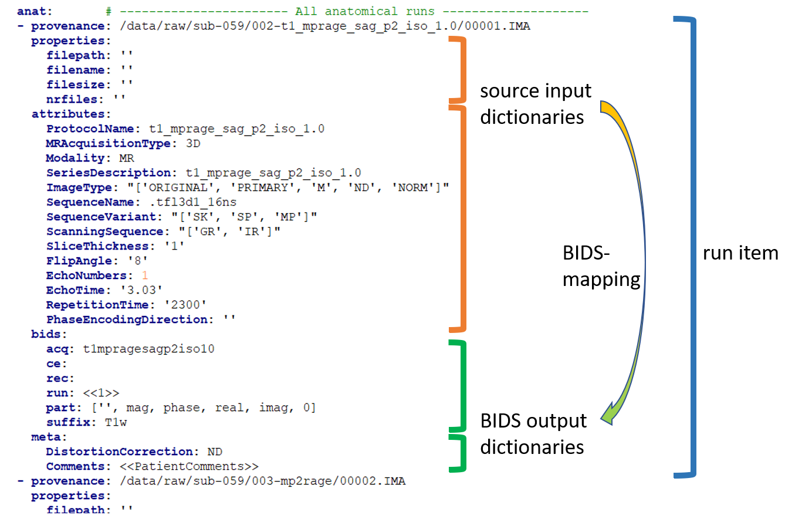
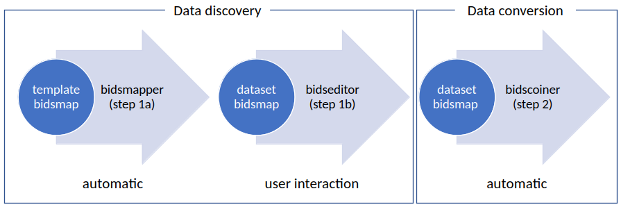

The bidsmap explained
=====================

Structure and content
---------------------

A central concept in BIDScoin is the so-called bidsmap. Generally speaking, a bidsmap is a collection of run-items that define how source data types (e.g. a T1w- or a T2w-scan) should be converted to `BIDS data types <https://bids-specification.readthedocs.io/en/stable/02-common-principles.html#definitions>`__. As illustrated in the figure below (but see also the screenshot of the `edit window <screenshots.html>`__), run-items consist of a 'provenance' field and a 'properties', 'attributes', 'bids' and a 'meta' `dictionary <https://en.wikipedia.org/wiki/Associative_array>`__ (a set of key-value pairs):

1. The provenance field contains the pathname of a source data sample that is representative for the run-item. The provenance data is not strictly necessary but very useful for deeper inspection of the source data and for tracing back the conversion process, e.g. in case of encountering unexpected results
2. The properties dictionary contains file system properties of the data sample, i.e. the file path, the file name, the file size on disk and the number of files in the containing folder. Depending on your data management, this information allows or can help to identify different datatypes in your source data repository
3. The attributes dictionary contains attributes from the source data itself, such as the 'ProtocolName' from the DICOM header. The source attributes are a very rich source of information of which a minimal subset is normally sufficient to identify the different datatypes in your source data repository
4. The bids dictionary contains the BIDS datatype and entities that determine the filename of the BIDS output data. The values in this dictionary are encouraged to be edited by the user
5. The meta dictionary contains custom key-value pairs that are added to the json sidecar file by the BIDScoin plugins. Meta data may well vary from session to session, hence this dictionary often contains dynamic attribute values that are evaluated during bidscoiner runtime (see the `special features <#special-bidsmap-features>`__ below)

In sum, a run-item contains a single bids-mapping, which links the input dictionaries (2) and (3) to the output dictionaries (4) and (5).

   A snippet of study bidsmap in YAML format. The bidsmap contains separate sections for each source data format (here 'DICOM') and sub-sections for the BIDS datatypes (here 'anat'). The arrow illustrates how the 'properties' and 'attributes' input dictionaries are mapped onto the 'bids' and 'meta' output dictionaries. Note that the 'part' value in the bids dictionary is a list, which is presented in the bidseditor GUI as a drop-down menu (with the first empty item being selected). Also note the special double bracket dynamic values (<<..>>), which are explained `below <#special-bidsmap-features>`__.

At the root level, a bidsmap is hierarchically organised in data format sections, such as 'DICOM' and 'PAR', which in turn contain subsections for the 'participant_label' and 'session_label', subsections for the BIDS datatypes ('fmap', 'anat', 'func', 'perf', 'dwi', 'pet', 'meg', 'eeg', 'ieeg', 'beh') and for the 'extra_data' and 'exclude' datatypes. The particpicant- and session-label subsections are common to all run-items and contain key-value pairs that identify the subject and session labels. The datatype subsections contain the actual run-items. Next to the data format sections there is a general 'Options' section, that accommodates BIDScoin and plugin settings.

When BIDScoin routines process source data, they will scan the entire repository and take samples of the data and compare them with the run-items in the bidsmap until they come across a run-item of which all (non-empty) properties and attribute values match with the values extracted from the data sample at hand. At that point a bidsmapping is established. Within a datatype, run-items are matched from top to bottom, and scan order between datatypes is: 'exclude', 'fmap', 'anat', 'func', 'perf', 'dwi', 'pet', 'meg', 'eeg', 'ieeg', 'beh' and 'extra_data'. The 'exclude' datatype contains run-items for source data that need to be omitted when converting the source data to BIDS and the 'extra_data' datatype contains run-items for including miscellaneous data that is not (yet) defined in the BIDS specifications. Bidsmaps can contain an unlimited number of run-items, including multiple run-items mapping onto the same BIDS target (e.g. when you renamed your DICOM scan protocol halfway your study and you don't want that irrelevant change to be reflected in the BIDS output).

From template to study
----------------------

In BIDScoin a bidsmap can either be a template bidsmap or a study bidsmap. The difference between the two is that a template bidsmap is a comprehensive set of pre-defined run-items and serves as an input for the bidsmapper (see below) to automatically generate a first instantiation of a study bidsmap, containing just the matched run-items. Empty attribute values of the matched run-item will be expanded with values from the data sample, making the run-item much more specific and sensitive to small changes in the scan protocol. Users normally don't have to know about or interact with the template bidsmap, but they can create their own `customized template <advanced.html#customized-template-bidsmap>`__. The study bidsmap can be interactively edited by the bidseditor before feeding it to the bidscoiner, but it is also possible (but not recommended) to skip the editing step and convert the data without any user interaction.

   Creation and application of a study bidsmap

Special bidsmap features
------------------------

The dictionary values in a bidsmap are not simple strings but have some special features that make BIDScoin powerful, flexible and helpful:

* **Run-item matching**. Source property and attribute values of run-items in a bidsmap are interpreted as `regular expression patterns <https://docs.python.org/3/library/re.html>`__ when they are matched with your source data samples. For instance, a key-value pair of an attribute dictionary in your template bidsmap could be ``{ProtocolName: .*(mprage|T1w).*}``, which would test if the extracted attribute string for 'ProtocolName' from the `DICOM header <http://dicom.nema.org>`__ of a data sample contains either a 'mprage' or a 'T1w' substring. More precisely, the Python expression that is evaluated is: ``match = re.fullmatch('.*(mprage|T1w).*', 't1_mprage_sag_p2_iso_1.0')``) if the ProtocolName of the data sample is 't1_mprage_sag_p2_iso_1.0'.

* **Dynamic values**. Dictionary values can be static, in which case the value is just a normal string, or dynamic, when the string is enclosed with single or double pointy brackets. In case of single pointy brackets the bids value will be replaced during bidsmapper, bidseditor and bidscoiner runtime by the value of the source attribute or property of the data sample at hand. It is also possible to then extract a substring from the source string by adding a colon-separated regular expression to the bids value. For instance the two dynamic values in ``{acq: <MRAcquisitionType>Demo<SeriesDescription:t1_(.*?)_sag>}`` will be replaced by ``{acq: 3DDemoMPRAGE}`` if the 'MRAcquisitionType' of the data sample is '3D' and 'SeriesDescription' is 't1_MPRAGE_sag_p2_iso_1.0'. More precisely, the Python expression that is evaluated for the second  dynamic 'SeriesDescription' value is: ``substring = re.findall('t1_(.*?)_sag', 't1_mprage_sag_p2_iso_1.0')``. If dynamic values are enclosed with double pointy brackets, the only difference is that they will be replaced only during bidscoiner runtime -- this is useful for bids values that are subject/session dependent. Double bracket dynamic values can for instance be used to add DICOM meta data that is not saved by default in the json sidecar files, such as <<ImageComments>> or <<RadionuclideTotalDose>>. Another example is the extraction of the subject and session label. For instance, you can use ``<<filepath:/sub-(.*?)/>>`` to extract '003' (i.e. the shortest string between ``/sub-`` and ``/``) if the data for that subject is in ``/data/raw/sub-003/ses-01``. Alternatively, if the subject label is encoded in the DICOM ``PatientName`` as e.g. ``ID_003_anon``, then ``<<PatientName:ID_(.*?)_>>`` would likewise extract '003'. To test out dynamic values (either with or without appended regular expressions), you can handily enter them in the bidseditor within single brackets to instantly obtain their resulting value.

* **Run-index**. Dynamic values can handle many use cases and can be used throughout BIDScoin. Yet there are two exceptions that cannot always be handled directly with dynamic values. The first exception is the 'run'-index in the bids output dictionary, since this index number cannot usually be determined from the data file alone. In that case, if the run-index is a dynamic number (e.g. ``{run: <<1>>}``) and another output file with that run-index already exists, then during bidscoiner runtime this number will be incremented in compliance with the BIDS standard (e.g. to ``{run: 2}``). If the run index is encoded in the header or filename, then the index can unambiguously be extracted using dynamic values. For instance, using ``{run: <<ProtocolName:run-(.*?)_>>}`` will give ``{run: 3}`` if the DICOM ProtocolName is ``t1_mprage_sag_run-3_iso_1.0``.

* **IntendedFor**. The other exception not covered by dynamic values is the 'IntendedFor' value in the meta dictionary of fieldmaps. The IntendedFor value is a list of associated output files that you can specify within a dynamic value using Unix shell-style wildcards. In that way, the bidscoiner will lookup the path of these images on disk using the Python `glob(*dynamic_value*) <https://docs.python.org/3.8/library/pathlib.html#pathlib.Path.glob>`__ expression. For instance, using a simple ``{IntendedFor: <<task>>}`` value will lookup all functional runs in the BIDS subject[/session] folder (since in BIDS these runs always have 'task' in their filename), whereas a more specific ``{IntendedFor: <<func/*Stop*Go_bold><func/*Reward*_bold>>}`` value will select all 'Stop1Go'-, 'Stop2Go'- and 'Reward' bold-runs in the func sub-folder. In case duplicated fieldmaps are acquired (e.g. when a scan failed or a session was interrupted) you can limit the search scope by appending a colon-separated "bounding" term to the search pattern. E.g. ``{IntendedFor: <<task:[]>>}`` will bound the wildcard search to files that are 'uninterruptedly connected' to the current fieldmap, i.e. without there being another run of the fieldmap in between. The bounded search can be further constrained by limiting the maximum number of matches, indicated with lower and upper limits. For instance ``{IntendedFor: <<task:[-3:0]>>}`` will limit the bounded search to maximally three runs preceding the fieldmap. Similarly, ``{IntendedFor: <<task:[-2:2]>>}`` will limit the bounded search to maximally two preceding and two subsequent runs, and ``{IntendedFor: <<task:[0:]>>}`` will limit the bounded search to all matches acquired after the fieldmap. In this latter case, for the first fieldmap, only ``task-Stop_run-1`` and ``task-Stop_run-2`` will match the bounded search if the 5 collected runs were named: 1) ``fieldmap_run-1``, 2) ``task-Stop_run-1``, 3) ``task-Stop_run-2``, 4) ``fieldmap_run-2``, 5) ``task-Stop_run-3``. The second run of the fieldmap will match with ``task-Stop_run-3`` only (note that the second fieldmap would have matched all task runs if the bounding term would have been ``[]``, ``[:]`` or ``[-2:2]``).

* **Bids value lists**. Instead of a normal string, a bids dictionary value can also be a list of strings, with the last list item being the (zero-based) list index that selects the actual value from the list. For instance the list ``{part: ['', 'mag', 'phase', 'real', 'imag', 2]}`` would select 'phase' as the value belonging to 'part'. A bids value list is made visible in the bidseditor as a drop-down menu in which the user can select the value (i.e. set the list index).

.. tip::

   In addition to DICOM attribute names, the more advanced / unambiguous pydicom-style `tag numbers <https://pydicom.github.io/pydicom/stable/old/base_element.html#tag>`__ can also be used for indexing a DICOM header. For instance, the ``PatientName``, ``0x00100010``, ``0x10,0x10``, ``(0x10, 0x10)``, and ``(0010, 0010)`` index keys are all equivalent.
