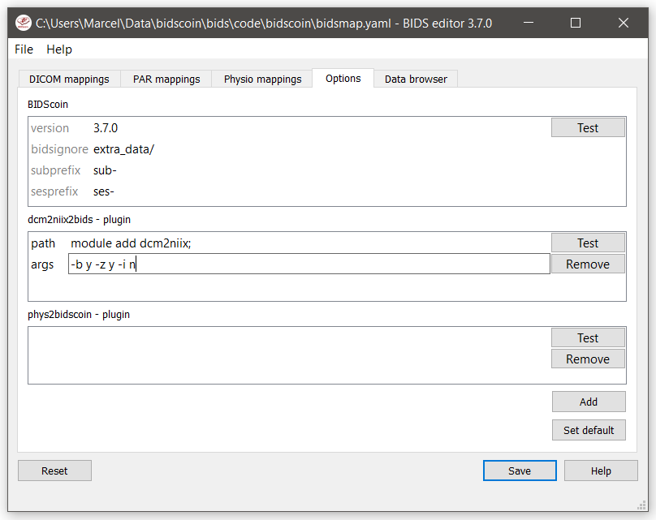

Options
=======

BIDScoin has different options and settings (see below) that can be adjusted per study bidsmap. You can use a text editor to edit the bidsmap template ``[path_to_bidscoin]/heuristics/bidsmap_template.yaml`` if you want to adjust the default)

   The bidseditor options window with the different BIDScoin settings

BIDScoin
--------

- ``version``:    should correspond with the version in ../bidscoin/version.txt
- ``bidsignore``: Semicolon-separated list of entries that are added to the .bidsignore file (for more info, see BIDS specifications), e.g.:

  - ``extra_data/;pet/;myfile.txt;yourfile.csv``

dcm2niix
--------

The nifti- and json-files are generated with `dcm2niix <https://github.com/rordenlab/dcm2niix>`__. Here you can adjust how dcm2niix is used:

- ``path``: Command to set the path to dcm2niix, e.g.:

  - ``module add dcm2niix/1.0.20180622;`` (note the semi-colon at the end)
  - ``PATH=/opt/dcm2niix/bin:$PATH;`` (note the semi-colon at the end)
  - ``/opt/dcm2niix/bin/``  (note the slash at the end)
  - ``'\"C:\\Program Files\\dcm2niix\"'`` (note the quotes to deal with the whitespace)

- ``args``: Argument string that is passed to dcm2niix. Click [Test] and see the terminal output for usage

.. note::
   SPM users may want to use '-z n', which produces unzipped nifti's

Plugins
-------

BIDScoin provides the possibility for researchers to write custom python functions that will be executed at bidsmapper and bidscoiner runtime. To use this functionality, enter the name of the module (default location is the plugins-folder; otherwise the full path must be provided) in the bidsmap dictionary file to import the plugin functions. The functions in the module should be named ``bidsmapper_plugin`` for bidsmapper and ``bidscoiner_plugin`` for bidscoiner. See ``[path_to_bidscoin]/plugins/README.py`` for more details and placeholder code.

