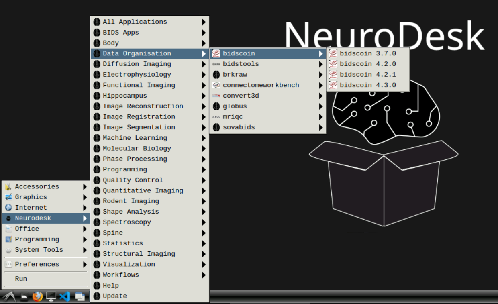

Play around
===========

Trying out BIDScoin in the cloud is just a few mouse clicks away! No need for registration or subscription, just launch a `Neurodesktop <https://play.neurodesk.org/>`__ on a server nearby:

- `Europe <https://play-frankfurt.neurodesk.org/>`__
- `North America <https://play-iowa.neurodesk.org/>`__
- `Australia <https://play-sydney.neurodesk.org/>`__

After a few seconds you will see a JupyterLab instance in your browser. In there, click on the ``Neurodesk`` icon and on your interface of choice (e.g. RDP). If all goes well, you will get a fully functional Linux desktop interface running in your browser! As illustrated below, you can then launch a BIDScoin terminal and play around, for instance by running the `BIDScoin tutorial <./tutorial.html>`__.

Please visit the `Neurodesk website <https://www.neurodesk.org/>`__ for more information and troubleshooting

   The Neurodesk interface with menu items for launching a bash terminal in which you can run your BIDScoin commands.

.. tip::

   If you don't have the latest BIDScoin version in your Neurodesk menu, then click on the ``Update`` menu item (depicted in the bottom of the screenshot above)
