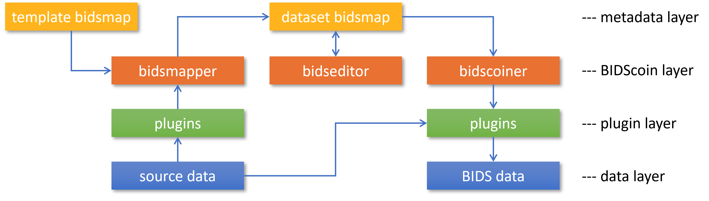

Plugins
=======

As shown in the figure below, all interactions of BIDScoin routines with source data are done via a plugin layer that abstracts away differences between source data formats. The bidsmapper and bidscoiner tools loop over the subjects/sessions in your source data repository and then use the plugins that are listed in the bidsmap to do the actual work.

   The BIDScoin architecture and dataflow, showing different layers of abstraction. The BIDScoin layer interacts with the plugins using a single programming interface (API), which in turn interact with the source data in a dataformat dependent way. The BIDScoin layer also interacts with the metadata layer, where all prior knowledge and mapping information is stored.

You can use the ``bidscoin`` utility to list, install or uninstall BIDScoin plugins, but the following plugins come pre-installed:

Dcm2niix2bids: a plugin for DICOM and PAR/XML data
--------------------------------------------------

The 'dcm2niix2bids' plugin is a wrapper around the well-known pydicom, nibabel and (in particular) `dcm2niix <https://github.com/rordenlab/dcm2niix>`__ tools to interact with and convert DICOM and Philips PAR(/REC)/XML source data. Pydicom is used to read DICOM attributes, nibabel is used to read PAR/XML attribute values and dcm2niix is used to convert the DICOM and PAR/XML source data to NIfTI and create BIDS sidecar files. Personal data from the source header (e.g. Age, Sex) is added to the BIDS participants.tsv file.

Spec2nii2bids: a plugin for MR spectroscopy data
------------------------------------------------

The 'spec2nii2bids' plugin is a wrapper around the recent `spec2nii <https://github.com/wtclarke/spec2nii>`__ Python library to interact with and convert MR spectroscopy source data. Presently, the spec2nii2bids plugin is a first implementation that supports the conversion of Philips SPAR/SDAT files, Siemens Twix files and GE P-files to NIfTI, in conjunction with BIDS sidecar files.

Nibabel2bids: a generic plugin for imaging data
-----------------------------------------------

The nibabel2bids plugin wraps around the flexible `nibabel <https://nipy.org/nibabel>`__ tool to convert a wide variety of data formats into NIfTI-files. Currently, the default template bidsmap is tailored to NIfTI source data only (but this can readily be extended), and BIDS sidecar files are not automatically produced by nibabel (but see the note further below).

Pet2bids: a plugin for PET data
-------------------------------

The 'pet2bids' plugin is a wrapper around the `PET2BIDS <https://github.com/openneuropet/PET2BIDS>`__ tool. PET2BIDS accepts PET imaging and blood data as inputs (e.g. DICOM, ECAT, spreadsheets) and delivers BIDS formatted outputs. An installation of dcm2niix (https://github.com/rordenlab/dcm2niix) is required to convert DICOM data.

.. note::
   Out of the box, BIDScoin plugins typically produce sidecar files that contain metadata from the source headers. However, when such meta-data is missing (e.g. as for nibabel2bids), or when it needs to be appended or overruled, then users can add sidecar files to the source data (as explained `here <bidsmap.html>`__) or add that meta-data using the bidseditor (the latter takes precedence).

The plugin programming interface
--------------------------------

This paragraph describes the requirements and structure of plugins in order to allow advanced users and developers to write their own plugin and extent or customize BIDScoin to their needs.

The main task of a plugin is to perform the actual conversion of the source data into a format that is part of the BIDS standard. BIDScoin offers the library module named 'bids' to interact with bidsmaps and to provide the intended output names and meta data. Moreover, the bids library contains a class named ``DataSource()`` that is (strongly) recommended to be used for reading the source data attributes and properties. In this way, the extended source data attributes and dynamic values (including regular expressions) are handled transparently, ensuring consistent results throughout BIDScoin.

However, if you have a long list of extended attributes it can be cumbersome to put them all in the metadata table (even though you can right-click to import data there). This is where the copymetadata() function comes in. This is meant to be used by the plugins during bidscoiner runtime, and just transfers all extra source metadata to the BIDS folder (for each plugin, the user can control this if needed in the bidseditor by setting the allowed file extensions of the extra source metadata files). A scenario where copymetadata is very useful is e.g. when you have a non-BIDS nifti dataset that was created using dcm2niix and now you want to convert that to BIDS (in that case you just want to copy over all the metadata in the json files). The nibabel2bids plugin can do exactly that. NB: copymetadata is still a very rudimentary function (I never needed it myself so I didn't develop it very much)

If a field is present in the metadata table and also in the metadata transferred by copymetadata, then the metadata table should take precedence (this should be implemented as such in the plugin), so that the user gets what he sees in the bidseditor (WYSIWYG).

As can be seen in the API code snippet below (but also see the default plugins for reference implementation), a BIDScoin plugin is a Python module with the following programming interface (functions):

.. code-block:: python3

   """
   This module contains placeholder code demonstrating the bidscoin plugin API, both for the bidsmapper and for
   the bidscoiner. The functions in this module are called if the basename of this module (when located in the
   plugins-folder; otherwise the full path must be provided) is listed in the bidsmap. The following plugin functions
   are expected to be present:

   - test:                 A test function for the plugin + its bidsmap options. Can be called by the user from the bidseditor and the bidscoin utility
   - is_sourcefile:        A function to assess whether a source file is supported by the plugin. The return value should correspond to a data format section in the bidsmap
   - get_attribute:        A function to read an attribute value from a source file
   - bidsmapper_plugin:    A function to discover BIDS-mappings in a source data session
   - bidscoiner_plugin:    A function to convert a single source data session to bids according to the specified BIDS-mappings

   To avoid code duplications and minimize plugin development time, various support functions are available in
   BIDScoin's library modules named 'bidscoin' and, most notably, 'bids'
   """

   import logging
   from pathlib import Path

   LOGGER = logging.getLogger(__name__)

   # The default options that are set when installing the plugin
   OPTIONS = {'command': 'demo',   # Plugin option
              'args': 'foo bar'}   # Another plugin option

   # The default bids-mappings that are added when installing the plugin
   BIDSMAP = {'DemoFormat':{
       'subject': '<<filepath:/sub-(.*?)/>>',          # This filesystem property extracts the subject label from the source directory. NB: Any property or attribute can be used, e.g. <PatientID>
       'session': '<<filepath:/sub-.*?/ses-(.*?)/>>',  # This filesystem property extracts the session label from the source directory. NB: Any property or attribute can be used, e.g. <StudyID>

       'func': [                   # ----------------------- All functional runs --------------------
           {'provenance': '',      # The fullpath name of the source file from which the attributes and properties are read. Serves also as a look-up key to find a run in the bidsmap
            'properties':          # The matching (regexp) criteria go in here
               {'filepath': '',    # File folder, e.g. ".*Parkinson.*" or ".*(phantom|bottle).*"
                'filename': '',    # File name, e.g. ".*fmap.*" or ".*(fmap|field.?map|B0.?map).*"
                'filesize': '',    # File size, e.g. "2[4-6]\d MB" for matching files between 240-269 MB
                'nrfiles': ''},    # Number of files in the folder that match the above criteria, e.g. "5/d/d" for matching a number between 500-599
            'attributes':          # The matching (regexp) criteria go in here
               {'ch_num': '.*',
                'filetype': '.*',
                'freq': '.*',
                'ch_name': '.*',
                'units': '.*',
                'trigger_idx': '.*'},
            'bids':
               {'task': '',
                'acq': '',
                'ce': '',
                'dir': '',
                'rec': '',
                'run': '<<1>>',    # This will be updated during bidscoiner runtime (as it depends on the already existing files)
                'recording': '',
                'suffix': 'physio'},
            'meta':                # This is an optional entry for meta-data dictionary that are appended to the json sidecar files
               {'TriggerChannel': '<<trigger_idx>>',
                'ExpectedTimepoints': '<<num_timepoints_found>>',
                'ChannelNames': '<<ch_name>>',
                'Threshold': '<<thr>>',
                'TimeOffset': '<<time_offset>>'}}],

       [...]

       'exclude': [  # ----------------------- Data that will be left out -------------
           {'provenance': '',
            'properties':
               {'filepath': '',
                'filename': '',
                'filesize': '',
                'nrfiles': ''},
            'attributes':
               {'ch_num': '.*',
                'filetype': '.*',
                'freq': '.*',
                'ch_name': '.*',
                'units': '.*',
                'trigger_idx': '.*'},
            'bids':
               {'task': '',
                'acq': '',
                'ce': '',
                'dir': '',
                'rec': '',
                'run': '<<1>>',
                'recording': '',
                'suffix': 'physio'},
            'meta':
               {'TriggerChannel': '<<trigger_idx>>',
                'ExpectedTimepoints': '<<num_timepoints_found>>',
                'ChannelNames': '<<ch_name>>',
                'Threshold': '<<thr>>',
                'TimeOffset': '<<time_offset>>'}}]}}

   def test(options: dict=OPTIONS) -> bool:
       """
       Performs a runtime/integration test of the working of the plugin + its bidsmap options

       :param options: A dictionary with the plugin options, e.g. taken from the bidsmap['Options']['plugins']['README']
       :return:        The errorcode (e.g 0 if the tool generated the expected result, > 0 if there was a tool error)
       """

       LOGGER.info(f'This is a demo-plugin test routine, validating its working with options: {options}')

       return 0

   def is_sourcefile(file: Path) -> str:
       """
       This plugin function assesses whether a sourcefile is of a supported dataformat

       :param file:    The sourcefile that is assessed
       :return:        The valid / supported dataformat of the sourcefile
       """

       if file.is_file():

           LOGGER.verbose(f'This is a demo-plugin is_sourcefile routine, assessing whether "{file}" has a valid dataformat')
           return 'dataformat' if file == 'supportedformat' else ''

        return ''

   def get_attribute(dataformat: str, sourcefile: Path, attribute: str, options: dict) -> str:
       """
       This plugin function reads attributes from the supported sourcefile

       :param dataformat:  The bidsmap-dataformat of the sourcefile, e.g. DICOM of PAR
       :param sourcefile:  The sourcefile from which the attribute value should be read
       :param attribute:   The attribute key for which the value should be read
       :param options:     A dictionary with the plugin options, e.g. taken from the bidsmap['Options']
       :return:            The attribute value
       """

       if dataformat in ('DICOM','PAR'):
           LOGGER.verbose(f'This is a demo-plugin get_attribute routine, reading the {dataformat} "{attribute}" attribute value from "{sourcefile}"')

       return ''

   def bidsmapper_plugin(session: Path, bidsmap_new: dict, bidsmap_old: dict, template: dict, store: dict) -> None:
       """
       All the logic to map the Philips PAR/XML fields onto bids labels go into this plugin function. The function is
       expecte to update / append new runs to the bidsmap_new data structure. The bidsmap options for this plugin can
       be found in:

       bidsmap_new/old['Options']['plugins']['README']

       See also the dcm2niix2bids plugin for reference implementation

       :param session:     The full-path name of the subject/session raw data source folder
       :param bidsmap_new: The new study bidsmap that we are building
       :param bidsmap_old: The previous study bidsmap that has precedence over the template bidsmap
       :param template:    The template bidsmap with the default heuristics
       :param store:       The paths of the source- and target-folder
       :return:
       """

       LOGGER.verbose(f'This is a bidsmapper demo-plugin working on: {session}')

   def bidscoiner_plugin(session: Path, bidsmap: dict, bidsses: Path) -> None:
       """
       The plugin to convert the runs in the source folder and save them in the bids folder. Each saved datafile should be
       accompanied by a json sidecar file. The bidsmap options for this plugin can be found in:

       bidsmap_new/old['Options']['plugins']['README']

       See also the dcm2niix2bids plugin for reference implementation

       :param session:     The full-path name of the subject/session source folder
       :param bidsmap:     The full mapping heuristics from the bidsmap YAML-file
       :param bidsses:     The full-path name of the BIDS output 'ses-' folder
       :return:            Nothing
       """

       LOGGER.debug(f'This is a bidscoiner demo-plugin working on: {session} -> {bidsfolder}')

*The README plugin placeholder code*
