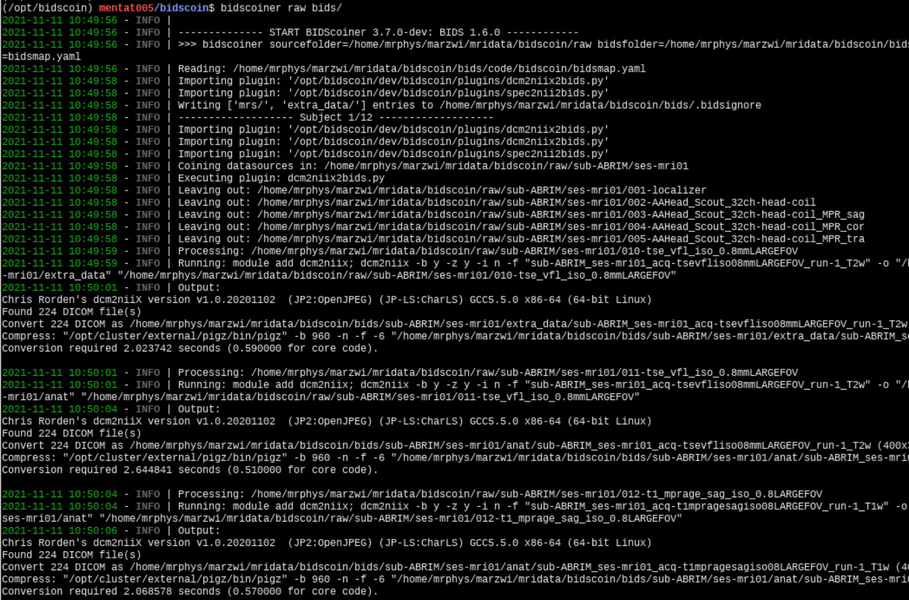

Screenshots
===========

The BIDScoin architecture
~~~~~~~~~~~~~~~~~~~~~~~~~

.. figure:: ./_static/bidscoin_architecture.png

   The BIDScoin architecture and dataflow, showing different layers of abstraction. The BIDScoin layer interacts with the plugins using a single programming interface (API), which in turn interact with the source data in a dataformat dependent way. The BIDScoin layer also interacts with the metadata layer, where all mapping information is stored.

The bidseditor
~~~~~~~~~~~~~~

.. figure:: ./_static/bidseditor_main.png

   The bidseditor main window with an overview of the data types in the source data (left column) with a preview of the BIDS output names (right column). The green or red color indicates whether manual editing of the BIDS-mapping is necessary, while the strikeout text indicates that the datatype will not be converted, which is useful for handling irrelevant data. The user can edit the ``subject`` and ``session`` property values if needed (``session`` can be left empty to be omitted) and the result is immediately reflected in the preview. Different tabs represent different data formats in the source dataset, i.e. DICOM and PAR, which are represented as separate sections in the bidsmap. In addition, there is a tab to edit the study specific options and a tab in which the user can browse the organization of the source data and inspect the data.

.. figure:: ./_static/bidseditor_edit_tooltip.png

   The BIDS-mapping edit window featuring file name matching ``(.*\.IMA)`` and dynamic metadata values (e.g. ``TimeZero``). BIDS values that are restricted to a limited set are presented with a drop-down menu (here labeled [Data type], [rec] and [suffix]). The user can immediately see the results of their edits in the preview of the BIDS output filename. A green filename indicates that the name is compliant with the BIDS standard, whereas a red name indicates that the user still needs to fill out one or more compulsory bids values (with a pop-up window appearing if the user ignores it). Hoovering with the mouse over features explanatory text from the BIDS schema files. Double clicking on the DICOM filename opens a new window displaying the full header information with all attributes. The user can export the customized mapping to a different bidsmap on disk.

.. figure:: ./_static/bidseditor_options.png
   :scale: 60%

   The bidsmap options for BIDScoin and its plugins. The user can manage the plugins that will be used with the [Add] and [Remove] buttons, and save the current options to the template bidsmap by using the [Set as default] button.

The bidscoiner
~~~~~~~~~~~~~~

   Snapshot of running `bidscoiner` in the terminal.
