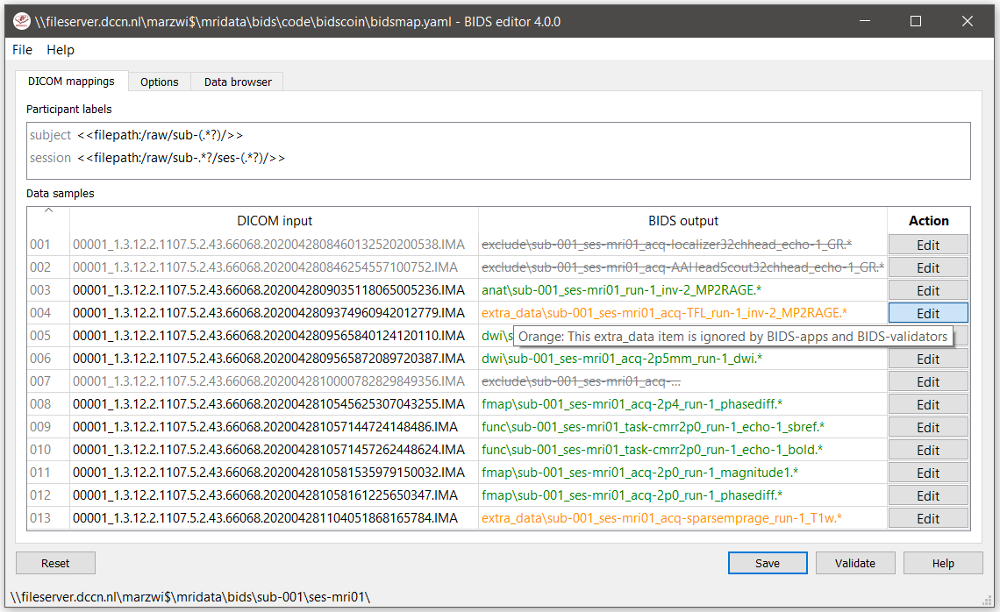
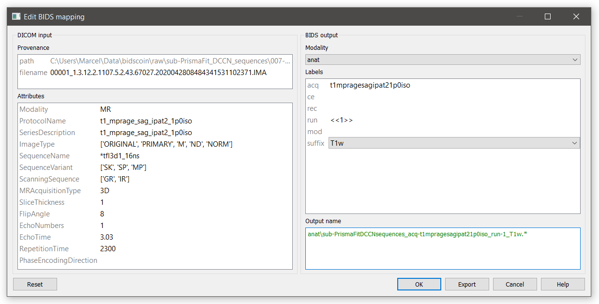

The BIDScoin workflow
=====================

With a sufficiently `organized source data folder <./preparation.html>`__, the data conversion to BIDS can be performed by running the `(1a) <#step-1a-running-the-bidsmapper>`__ the bidsmapper, `(1b) <#step-1b-running-the-bidseditor>`__ the bidseditor and `(2) <#step-2-running-the-bidscoiner>`__ the bidscoiner command-line tools. The bidsmapper starts by building a map of the different kind of data types (scans) in your source dataset, which you can then edit with the bidseditor. The bidscoiner reads this so-called study bidsmap, which tells it how exactly to convert ("coin") the source data into a BIDS data repository.

.. figure:: ./_static/bidsmap_flow.png

   Creation and application of a study bidsmap

By default, when finished the bidsmapper automatically launches the bidseditor, so in its simplest form, all you need to do to convert your raw source data into BIDS is to run two simple shell commands, e.g.:

.. code-block:: console

    $ bidsmapper sourcefolder bidsfolder    # Scans your data and creates a study bidsmap
    $ bidscoiner sourcefolder bidsfolder    # Converts your data to BIDS using the study bidsmap

If you add new subjects all you need to do is re-run the bidscoiner -- unless the scan protocol was changed, then you also need to first re-run the bidsmapper to add the new samples to the study bidsmap. The paragraphs below describe the BIDScoin workflow in more detail.

.. tip::
   If you don't know what shell command to use or what to do, run the ``bidscoin`` command to give you a workflow overview

Step 1a: Running the bidsmapper
-------------------------------

::

    usage: bidsmapper [-h] [-b BIDSMAP] [-t TEMPLATE] [-p PLUGINS [PLUGINS ...]] [-n SUBPREFIX]
                      [-m SESPREFIX] [-u UNZIP] [-s] [-a] [-f] [--no-update]
                      sourcefolder bidsfolder

    The bidsmapper scans your source data repository to identify different data types by matching
    them against the run-items in the template bidsmap. Once a match is found, a mapping to BIDS
    output data types is made and the run-item is added to the study bidsmap. You can check and
    edit these generated bids-mappings to your needs with the (automatically launched) bidseditor.
    Re-run the bidsmapper whenever something was changed in your data acquisition protocol and
    edit the new data type to your needs (your existing bidsmap will be re-used).

    The bidsmapper uses plugins, as stored in the bidsmap['Options'], to do the actual work

    positional arguments:
      sourcefolder          The study root folder containing the raw source data folders
      bidsfolder            The destination folder with the (future) bids data and the
                            bidsfolder/code/bidscoin/bidsmap.yaml output file

    options:
      -h, --help            show this help message and exit
      -b BIDSMAP, --bidsmap BIDSMAP
                            The study bidsmap file with the mapping heuristics. If the bidsmap filename
                            is relative (i.e. no '/' in the name) then it is assumed to be located in
                            bidsfolder/code/bidscoin. Default: bidsmap.yaml
      -t TEMPLATE, --template TEMPLATE
                            The bidsmap template file with the default heuristics (this could be provided
                            by your institute). If the bidsmap filename is relative (i.e. no '/' in the
                            name) then it is assumed to be located in bidsfolder/code/bidscoin. Default:
                            bidsmap_dccn
      -p PLUGINS [PLUGINS ...], --plugins PLUGINS [PLUGINS ...]
                            List of plugins to be used. Default: the plugin list of the study/template
                            bidsmap)
      -n SUBPREFIX, --subprefix SUBPREFIX
                            The prefix common for all the source subject-folders (e.g. 'Pt' is the
                            subprefix if subject folders are named 'Pt018', 'Pt019', ...). Use '*' when
                            your subject folders do not have a prefix. Default: the value of the
                            study/template bidsmap, e.g. 'sub-'
      -m SESPREFIX, --sesprefix SESPREFIX
                            The prefix common for all the source session-folders (e.g. `M_` is the
                            subprefix if session folders are named 'M_pre', 'M_post', ..). Use '*' when
                            your session folders do not have a prefix. Default: the value of the
                            study/template bidsmap, e.g. 'ses-'
      -u UNZIP, --unzip UNZIP
                            Wildcard pattern to unpack tarball/zip-files in the sub/ses sourcefolder that
                            need to be unzipped (in a tempdir) to make the data readable. Default: the
                            value of the study/template bidsmap
      -s, --store           Store provenance data samples in the bidsfolder/code/provenance folder
                            (useful for inspecting e.g. zipped or transfered datasets)
      -a, --automated       Save the automatically generated bidsmap to disk and without interactively
                            tweaking it with the bidseditor
      -f, --force           Discard the previously saved bidsmap and logfile
      --no-update           Do not update any sub/sesprefixes in or prepend the sourcefolder name to the
                            <<filepath:regex>> expression that extracts the subject/session labels. This
                            is normally done to make the extraction more robust, but could cause problems
                            for certain use cases

    examples:
      bidsmapper myproject/raw myproject/bids
      bidsmapper myproject/raw myproject/bids -t bidsmap_custom  # Uses a template bidsmap of choice
      bidsmapper myproject/raw myproject/bids -p nibabel2bids    # Uses a plugin of choice
      bidsmapper myproject/raw myproject/bids -u '*.tar.gz'      # Unzip tarball sourcefiles

After the source data has been scanned, the bidsmapper will automatically launch `step 1b <#step-1b-running-the-bidseditor>`__ to let the user check and edit the automatically generated study bidsmap. For a fully automated workflow users can skip this interactive step using the ``-i`` option (see above).

.. tip::
   The default template bidsmap (``-t bidsmap_dccn``) is customized for acquisitions at the DCCN. If this bidsmap is not working well for you, consider `adapting it to your needs <./bidsmap.html#building-your-own-template-bidsmap>`__ so that the bidsmapper can recognize more of your scans and automatically map them to BIDS the way you prefer.

Step 1b: Running the bidseditor
-------------------------------

::

    usage: bidseditor [-h] [-b BIDSMAP] [-t TEMPLATE] bidsfolder

    This application launches a graphical user interface for editing the bidsmap that is produced
    by the bidsmapper. You can edit the BIDS data types and entities until all run-items have a
    meaningful and nicely readable BIDS output name. The (saved) bidsmap.yaml output file will be
    used by the bidscoiner to do the conversion of the source data to BIDS.

    You can hoover with your mouse over items to get help text (pop-up tooltips).

    positional arguments:
      bidsfolder            The destination folder with the (future) bids data

    options:
      -h, --help            show this help message and exit
      -b BIDSMAP, --bidsmap BIDSMAP
                            The study bidsmap file with the mapping heuristics. If the bidsmap filename
                            is relative (i.e. no "/" in the name) then it is assumed to be located in
                            bidsfolder/code/bidscoin. Default: bidsmap.yaml
      -t TEMPLATE, --template TEMPLATE
                            The template bidsmap file with the default heuristics (this could be provided
                            by your institute). If the bidsmap filename is relative (i.e. no "/" in the
                            name) then it is assumed to be located in bidsfolder/code/bidscoin. Default:
                            bidsmap_dccn

    examples:
      bidseditor myproject/bids
      bidseditor myproject/bids -t bidsmap_dccn.yaml
      bidseditor myproject/bids -b my/custom/bidsmap.yaml

Main window
^^^^^^^^^^^

As shown below, the main window of the bidseditor opens with separate data mapping tabs for each data format that is present in the bidsmap (here ``DICOM mappings`` and ``PAR mappings``). The data mapping tabs consist of a ``Participant labels`` table and a ``Data samples`` table. By default, the participant table contains `dynamic <./bidsmap.html#special-bidsmap-features>`__ ``<<filepath:regex>>`` property values, which are used to extract the subject and session labels from the path of the source data during bidscoiner runtime. Alternatively, you can put a dynamic attribute value there (e.g. <<PatientName>>) if you want to extract that information from the source header. The data samples table shows a list of input files (left side) that uniquely represent all the different data types in the sourcedata repository, in conjunction with a preview of their ``BIDS output`` names (right side). The BIDS output names are shown in red if they are not BIDS compliant, crossed-out gray when the runs will be ignored / skipped in the conversion to BIDS, otherwise it is colored green.



   The main window with the ``DICOM mappings`` tab, an ``Options`` tab and a ``Data browser`` tab. The selected ``DICOM mappings`` tab shows an overview of how DICOM source data types (left) are mapped to BIDS output data (right). The BIDScoin settings used for this study can be adjusted in the `Options <./options.html>`__ tab and the ``Data browser`` tab can be used to inspect the source data structure.

.. tip::
   If the default subject/session expression (e.g. ``/sub-(.*?)/`` where ``sub-`` can be substituted by your prefix) fails to parse the subject or session label, try prepending (a part of) the sourcefolder path, e.g. if your data is in ``/project/sourcedata/s001/..`` and your subject prefix is ``s``, try ``<<filepath:/sourcedata/s(.*?)/>>`` for extracting the ``001`` subject label. This is especially useful if your subject folders have no or a very short prefix.

.. tip::
   Clear the ``session`` label field if you have data with only one session. This will remove the optional session label from the BIDS output name

Edit window
^^^^^^^^^^^

In the main window, you can double-click the BIDS output name of a data sample or click the [Edit] button next to it (NB: the ``*`` in this button indicates that attention is required) to open a new window, as shown below. In this new window, the full bids-mapping info of the clicked data-sample (AKA run-item) is shown, with the filesystem ``Properties`` and file ``Attributes`` input on the left, and, most importantly, the associated BIDS ``Data type``, ``Data filename`` and ``Meta data`` output on the right. Editing the properties and attributes is usually not necessary and considered advanced usage, so you can focus on the BIDS output tables on the right. You should first make sure the BIDS ``Data type`` (drop down menu) and its ``suffix`` label (drop down menu) are set correctly, and then you should edit the (automatically generated) BIDS values that you think are not optimal or incorrect (double-click the cell). Each time an item is edited, a new ``Data filename`` preview is shown (green or red text indicates that the name is BIDS compliant or not). In the ``Meta data`` table (see the figure below) you can enter key-value pairs that you like to be stored as BIDS meta-data in the json sidecar file. Right-clicking the meta table allows you to import meta-data from JSON/YAML/CSV/TSV files on disk.

If the preview of the BIDS filename and meta-data both look good, you can store the data in the bidsmap by clicking the [OK] button.



   The edit window for customizing a bidsmap run item, featuring the DICOM attributes mapped onto BIDS values and (dynamic) metadata values (e.g. ``Comments``). BIDS values that are restricted to a limited set are presented with a drop-down menu.

Finally, if all BIDS output names in the main window are fine, you can click on the [Save] button and proceed with running the bidscoiner tool (step 2). Note that re-running the bidsmapper or bidseditor is always a safe thing to do since these tools will re-use the existing bidsmap yaml-file and will not delete or write anything to disk except to the bidsmap yaml-file.

Field maps
``````````

Field maps are acquired and stored in various (sequences and manufacturer dependent) ways and may require some special treatment. For instance, it could be that you have ``magnitude1`` and ``magnitude2`` data in one series-folder (which is what Siemens can do). In that case you should select the ``magnitude1`` suffix and let bidscoiner automatically pick up the ``magnitude2`` during runtime (or vice versa). The same holds for ``phase1`` and ``phase2`` data. The suffix ``magnitude`` can be selected for sequences that save field maps directly. See the `BIDS specification <https://bids-specification.readthedocs.io/en/stable/04-modality-specific-files/01-magnetic-resonance-imaging-data.html#fieldmap-data>`__ for more details on field-map suffixes.

Field maps are typically acquired to be applied to specific other scans from the same session. The BIDS specification provides two `meta-data mechanisms <https://bids-specification.readthedocs.io/en/stable/04-modality-specific-files/01-magnetic-resonance-imaging-data.html#expressing-the-mr-protocol-intent-for-fieldmaps>`__ to store this semantic meta data (NB: BIDS-apps may not use your field map at all if you do not specify anything):

1. First there is the older ``IntendedFor`` mechanism that can handle more basic use cases, i.e. it explicitly specifies the path of the target images to which the field map should be applied, but it is left implicit from which images the field map is to be computed. You can enter a dynamic ``IntendedFor`` search string in the ``Meta data`` table to have BIDScoin automatically fill out this field for you. For instance you can simply use ``task-Stop*_bold`` as a search pattern to specify all functional runs in the BIDS session that have ``task-Stop`` and ``_bold`` as part of their filename. For more advanced usage and explanation, see the `special bidsmap features <./bidsmap.html#special-bidsmap-features>`__ section
2. Second, there is the new and more flexible ``B0Fieldmap`` mechanism that uses a ``B0FieldIdentifier`` to group all the images from which the field map can be computed, and a ``B0FieldSource`` to indicate which field map should be used to correct the image. For instance, you could use ``{B0FieldIdentifier: sbref_fmap}`` in your ``AP`` and ``PA`` PE-polar ``sbref`` images, in conjunction with ``{B0FieldSource: sbref_fmap}`` in your associated ``AP`` PE-polar ``bold`` image.

.. tip::
   The BIDScoin GUI features several ways to help you setting the right values:
   * Double-clicking an input filename pops-up an inspection window with the full header information (e.g. useful for checking attributes that are not (yet) in your bidsmap)
   * Hoovering with your mouse over a cell pops-up a tooltip with more background information (e.g. from the BIDS specifications)
   * Always check the terminal output and make sure there are no warnings or error messages there (a summary of them is printed when exiting the application)

Step 2: Running the bidscoiner
------------------------------

::

    usage: bidscoiner [-h] [-p PARTICIPANT_LABEL [PARTICIPANT_LABEL ...]] [-b BIDSMAP] [-f] [-c]
                      [-n NATIVESPEC]
                      sourcefolder bidsfolder

    Converts ("coins") your source datasets to NIfTI/json/tsv BIDS datasets using the mapping
    information from the bidsmap.yaml file. Edit this bidsmap to your needs using the bidseditor
    tool before running this function or (re-)run the bidsmapper whenever you encounter unexpected
    data. You can run bidscoiner after all data has been collected, or run / re-run it whenever
    new data has been added to your source folder (presuming the scan protocol hasn't changed).
    Also, if you delete a subject/session folder from the bidsfolder, it will simply be re-created
    from the sourcefolder the next time you run the bidscoiner.

    The bidscoiner uses plugins, as stored in the bidsmap['Options'], to do the actual work

    Provenance information, warnings and error messages are stored in the
    bidsfolder/code/bidscoin/bidscoiner.log file.

    positional arguments:
      sourcefolder          The study root folder containing the raw source data
      bidsfolder            The destination / output folder with the bids data

    options:
      -h, --help            show this help message and exit
      -p PARTICIPANT_LABEL [PARTICIPANT_LABEL ...], --participant_label PARTICIPANT_LABEL [PARTICIPANT_LABEL ...]
                            Space separated list of selected sub-# names / folders to be processed (the
                            sub-prefix can be removed). Otherwise all subjects in the sourcefolder will
                            be selected
      -b BIDSMAP, --bidsmap BIDSMAP
                            The study bidsmap file with the mapping heuristics. If the bidsmap filename
                            is relative (i.e. no "/" in the name) then it is assumed to be located in
                            bidsfolder/code/bidscoin. Default: bidsmap.yaml
      -f, --force           Process all subjects, regardless of existing subject folders in the
                            bidsfolder. Otherwise these subject folders will be skipped
      -c, --cluster         Use the DRMAA library to submit the bidscoiner jobs to a high-performance
                            compute (HPC) cluster
      -n NATIVESPEC, --nativespec NATIVESPEC
                            DRMAA native specifications for submitting bidscoiner jobs to the HPC cluster
                            (default: -l walltime=00:30:00,mem=4gb)

    examples:
      bidscoiner myproject/raw myproject/bids
      bidscoiner -f myproject/raw myproject/bids -p sub-009 sub-030

.. tip::
   * Always check the terminal output for possible warnings or errors (a summary of them is printed at the end)
   * Check your json sidecar files of your field maps, in particular see if they have the expected ``IntendedFor``/``B0FieldIdentifier`` values

.. note::
   * The provenance of the produced BIDS data-sets is stored in the ``[bidsfolder]/code/bidscoin/bidscoiner.log`` file. This file is also very useful for debugging / tracking down bidscoin issues
   * Privacy-sensitive source data samples may be stored in ``[bidsfolder]/code/bidscoin/provenance`` (see the ``-s`` option in the `bidsmapper <./workflow.html#step-1a-running-the-bidsmapper>`__)
   * Small anonymized data snippets are send to the BIDScoin developers to generate usage and error statistics. For more information and opt-out run ``bidscoin --tracking show``

Finishing up
------------

After a successful run of bidscoiner, the work to convert your data in a fully compliant BIDS dataset is usually not fully over and, depending on the complexity of your data-set, additional tools may need to be run to post-process (e.g. deface) your data or convert datatypes not supported by the standard BIDScoin plugins (e.g. EEG data). BIDScoin comes with some bidsapps that can help you finishing up your bids data repository.

Adding more meta-data
^^^^^^^^^^^^^^^^^^^^^
To make your dataset reproducable and shareable, you should add study-level meta-data in the modality agnostic BIDS files (BIDScoin saves stub versions of them). For instance, you should update the content of the ``dataset_description.json`` and ``README`` files in your bids folder and you may need to provide e.g. additional ``*_sessions.tsv`` or ``participants.json`` files (see the `BIDS specification <https://bids-specification.readthedocs.io/en/stable/03-modality-agnostic-files.html>`__ for more information). Moreover, if you have behavioural log-files you will find that BIDScoin does not (yet) support converting these into BIDS compliant ``*_events.tsv/json`` files (advanced users are encouraged to use the bidscoiner `plug-in <./plugins.html>`__ option and write their own log-file parser).

BIDS validation
^^^^^^^^^^^^^^^

If all of the above work is done, you can (and should) run the web-based `BIDS Validator <https://bids-standard.github.io/bids-validator/>`__ to check for inconsistencies or missing files in your bids data-set (NB: the BIDS Validator also exists as a `command-line tool <https://github.com/bids-standard/bids-validator>`__).
