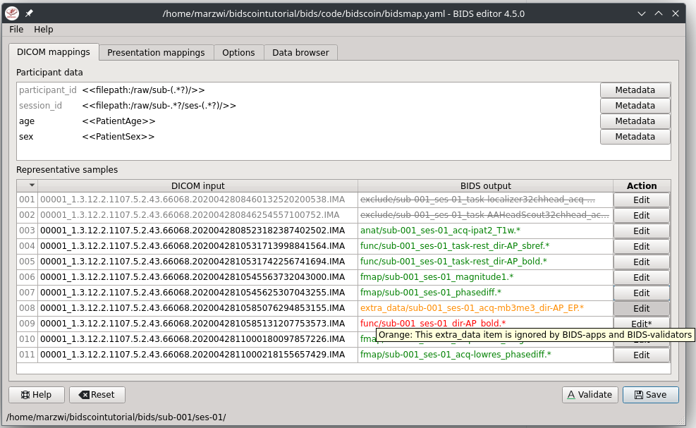

The BIDScoin workflow
=====================

With a sufficiently `organized source data folder <preparation.html>`__, the data conversion to BIDS can be performed by running the `(1a) <#step-1a-running-the-bidsmapper>`__ the bidsmapper, `(1b) <#step-1b-running-the-bidseditor>`__ the bidseditor and `(2) <#step-2-running-the-bidscoiner>`__ the bidscoiner command-line tools. The bidsmapper starts by building a map of the different kind of data types (scans) in your source dataset, which you can then edit with the bidseditor. The bidscoiner reads this so-called study bidsmap, which tells it how exactly to convert ("coin") the source data into a BIDS data repository.

.. figure:: ./_static/bidsmap_flow.png

   Creation and application of a study bidsmap

By default, step 1a automatically launches step 1b, so in it's simplest form, all you need to do to convert your raw source data into BIDS is to run two simple commands, e.g.:

.. code-block:: console

    $ bidsmapper sourcefolder bidsfolder
    $ bidscoiner sourcefolder bidsfolder

If you add new subjects all you need to do is re-run the bidscoiner -- unless the scan protocol was changed, then you also need to first re-run the bidsmapper to add the new samples to the study bidsmap. The paragraphs below describe the BIDScoin worklow in more detail.

Step 1a: Running the bidsmapper
-------------------------------

::

    usage: bidsmapper [-h] [-b BIDSMAP] [-t TEMPLATE] [-n SUBPREFIX] [-m SESPREFIX] [-s] [-a] [-f] [-v]
                      sourcefolder bidsfolder

    The bidsmapper scans your source data repository to identify different data types by matching
    them against the run-items in the template bidsmap. Once a match is found, a mapping to BIDS
    output data types is made and the run-item is added to the study bidsmap. You can check and edit
    these generated bids-mappings to your needs with the (automatically launched) bidseditor. Re-run
    the bidsmapper whenever something was changed in your data acquisition protocol and edit the new
    data type to your needs (your existing bidsmap will be re-used).

    The bidsmapper uses plugins, as stored in the bidsmap['Options'], to do the actual work

    positional arguments:
      sourcefolder          The study root folder containing the raw data in sub-#/[ses-#/]data
                            subfolders (or specify --subprefix and --sesprefix for different prefixes)
      bidsfolder            The destination folder with the (future) bids data and the
                            bidsfolder/code/bidscoin/bidsmap.yaml output file

    optional arguments:
      -h, --help            show this help message and exit
      -b BIDSMAP, --bidsmap BIDSMAP
                            The study bidsmap file with the mapping heuristics. If the bidsmap
                            filename is relative (i.e. no "/" in the name) then it is assumed to be
                            located in bidsfolder/code/bidscoin. Default: bidsmap.yaml
      -t TEMPLATE, --template TEMPLATE
                            The bidsmap template file with the default heuristics (this could be
                            provided by your institute). If the bidsmap filename is relative (i.e. no
                            "/" in the name) then it is assumed to be located in
                            bidsfolder/code/bidscoin. Default: bidsmap_dccn.yaml
      -n SUBPREFIX, --subprefix SUBPREFIX
                            The prefix common for all the source subject-folders. Default: 'sub-'
      -m SESPREFIX, --sesprefix SESPREFIX
                            The prefix common for all the source session-folders. Default: 'ses-'
      -s, --store           Flag to store provenance data samples in the
                            bidsfolder/'code'/'provenance' folder (useful for inspecting e.g. zipped
                            or transfered datasets)
      -a, --automated       Flag to save the automatically generated bidsmap to disk and without
                            interactively tweaking it with the bidseditor
      -f, --force           Flag to discard the previously saved bidsmap and logfile
      -v, --version         Show the installed version and check for updates

    examples:
      bidsmapper /project/foo/raw /project/foo/bids
      bidsmapper /project/foo/raw /project/foo/bids -t bidsmap_template

After the source data has been scanned, the bidsmapper will automatically launch `step 1b <#step-1b-running-the-bidseditor>`__ to let the user check and edit the automatically generated study bidsmap. For a fully automated workflow users can skip this interactive step using the ``-i`` option (see above).

.. tip::
   The default template bidsmap (``-t bidsmap_dccn``) is customized for acquisitions at the DCCN. If this bidsmap is not working well for you, consider `adapting it to your needs <advanced.html#customized-template-bidsmap>`__ so that the bidsmapper can recognize more of your scans and automatically map them to BIDS the way you prefer.

Step 1b: Running the bidseditor
-------------------------------

::

    usage: bidseditor [-h] [-b BIDSMAP] [-t TEMPLATE] [-n SUBPREFIX] [-m SESPREFIX] bidsfolder

    This application launches a graphical user interface for editing the bidsmap that is produced by
    the bidsmapper. You can edit the BIDS data types and entities until all run-items have a meaningful
    and nicely readable BIDS output name. The (saved) bidsmap.yaml output file will be used by the
    bidscoiner to do the conversion conversion of the source data to BIDS.

    You can hoover with your mouse over items to get help text (pop-up tooltips).

    positional arguments:
      bidsfolder            The destination folder with the (future) bids data

    optional arguments:
      -h, --help            show this help message and exit
      -b BIDSMAP, --bidsmap BIDSMAP
                            The study bidsmap file with the mapping heuristics. If the bidsmap
                            filename is relative (i.e. no "/" in the name) then it is assumed to
                            be located in bidsfolder/code/bidscoin. Default: bidsmap.yaml
      -t TEMPLATE, --template TEMPLATE
                            The template bidsmap file with the default heuristics (this could be
                            provided by your institute). If the bidsmap filename is relative (i.e.
                            no "/" in the name) then it is assumed to be located in
                            bidsfolder/code/bidscoin. Default: bidsmap_dccn.yaml
      -n SUBPREFIX, --subprefix SUBPREFIX
                            The prefix common for all the source subject-folders. Default: 'sub-'
      -m SESPREFIX, --sesprefix SESPREFIX
                            The prefix common for all the source session-folders. Default: 'ses-'

    examples:
      bidseditor /project/foo/bids
      bidseditor /project/foo/bids -t bidsmap_template.yaml
      bidseditor /project/foo/bids -b my/custom/bidsmap.yaml

Main window
^^^^^^^^^^^

As shown below, the main window of the bidseditor opens with separate data mapping tabs for each data format that is present in the bidsmap (here ``DICOM mappings`` and ``PAR mappings``). The data mapping tabs consist of a ``Participant labels`` table and a ``Data samples`` table. By default, the participant table contains `dynamic <bidsmap.html#special-bidsmap-features>`__ ``<<filepath:regexp>>`` property values, which are used to extract the subject and session labels from the path of the source data during bidscoiner runtime. Alternatively, you can put a dynamic attribute value there (e.g. <<PatientName>>) if you want to extract that information from the source header. The data samples table shows a list of input files (left side) that uniquely represent all the different data types in the sourcedata repository, in conjunction with a preview of their ``BIDS output`` names (right side). The BIDS output names are shown in red if they are not BIDS compliant, striked-out gray when the runs will be ignored / skipped in the conversion to BIDS, otherwise it is colored green.

   The main window with the ``DICOM mappings`` and ``PAR mappings`` tabs, an ``Options`` tab and a ``Data browser`` tab. The selected ``DICOM mappings`` tab shows an overview of how DICOM source data types (left) are mapped to BIDS output data (right). The BIDScoin settings used for this study can be adjusted in the `Options <options.html>`__ tab and the ``Data browser`` tab can be used to inspect the source data structure.

.. tip::
   Clear the ``session`` label field if you have data with only one seesion. This will remove the optional session label from the BIDS ouptput name

Edit window
^^^^^^^^^^^

In the main window, you can double-click the BIDS output name of a data sample or click the ``Edit`` button next to it (NB: the `*` in this button indicates that attention is required) to open a new window, as shown below. In this new window, the full bids-mapping info of the clicked data-sample (AKA run-item) is shown, with the filesystem ``Properties`` and file ``Attributes`` input on the left, and, most importantly, the associated BIDS ``Data type``, ``Data filename`` and ``Meta data`` output on the right. You should first make sure the BIDS ``Data type`` (drop down menu) and its ``suffix`` label (drop down menu) are set correctly, and then you should edit the (automatically generated) BIDS values that you think are not optimal or incorrect (double-click the cell). Each time an item is edited, a new ``Data filename`` preview is shown (green or red text indicates that the name is BIDS compliant or not). In the ``Meta data`` table (see the figure below) you can enter key-value pairs that you like to to be appended (by the standard ``dcm2niix2bids`` `plugin <advanced.html#plugins>`__) to the standard meta-data in the json sidecar file. Editing the source properties and attributes of a study bidsmap is usually not necessary and considered `advanced usage <advanced.html>`__.

If the preview of the BIDS filename and meta-data both look good, you can store the data in the bidsmap by clicking the ``OK`` button.

.. figure:: ./_static/bidseditor_edit.png

   The edit window for customizing a bidsmap run item, featuring file name matching (.*\.IMA) and dynamic metadata values (e.g. ``TimeZero``). BIDS values that are restricted to a limited set are presented with a drop-down menu (here the ``Data type``, the ``rec`` and the ``suffix`` value).

Finally, if all BIDS output names in the main window are fine, you can click on the ``Save`` button and proceed with running the bidscoiner tool (step 2). Note that re-running the bidsmapper or bidseditor is always a safe thing to do since these tools will re-use the existing bidsmap yaml-file and will not delete or write anything to disk except to the bidsmap yaml-file.

.. tip::
   The BIDScoin GUI features several ways to help you setting the right values:
   * Double-clicking an input filename pops-up an inspection window with the full header information (e.g. useful for checking attributes that are not (yet) in your bidsmap)
   * Hoovering with your mouse over a cell pops-up a tooltip with more background information (e.g. from the BIDS specifications)
   * Always check the terminal output and make sure there are no warnings or error messages there (a summary of them is printed when exiting the application)

.. note::
   **Fieldmaps** are acquired and stored in various (sequences and manufacturer dependent) ways and may require special treatment. For instance, it could be that you have ``magnitude1`` and ``magnitude2`` data in one series-folder (which is what Siemens can do). In that case you should select the ``magnitude1`` suffix and let bidscoiner automatically pick up the other magnitude image during runtime. The same holds for ``phase1`` and ``phase2`` data. The suffix ``magnitude`` can be selected for sequences that save fielmaps directly. See the `BIDS specification <https://bids-specification.readthedocs.io/en/stable/04-modality-specific-files/01-magnetic-resonance-imaging-data.html#fieldmap-data>`__ for more details on fieldmap suffixes.

   Fieldmaps are typically acquired to be applied to specific other scans from the same session. If this is the case then you should indicate this association in the ``IntendedFor`` meta-data field, either using a single search string or multiple `dynamic strings <bidsmap.html#special-features>`__ to select the runs that have that string pattern in their BIDS file name. For instance you can use ``task`` to select all functional runs or use ``<<Stop*Go><Reward>>`` to select "Stop1Go"-, "Stop2Go"- and "Reward"-runs. NB: bidsapps may not use your fieldmap at all if you leave this field empty!

Step 2: Running the bidscoiner
------------------------------

::

    usage: bidscoiner [-h] [-p PARTICIPANT_LABEL [PARTICIPANT_LABEL ...]] [-f] [-s]
                      [-b BIDSMAP] [-n SUBPREFIX] [-m SESPREFIX] [-v]
                      sourcefolder bidsfolder

    Converts ("coins") your source datasets to nifti / json / tsv BIDS datasets using
    the information from the bidsmap.yaml file. Edit this bidsmap to your needs using the
    bidseditor tool before running this function or (re-)run the bidsmapper whenever you
    encounter unexpected data. You can run bidscoiner after all data has been collected,
    or run / re-run it whenever new data has been added to your source folder (presuming
    the scan protocol hasn't changed). Also, if you delete a subject/session folder from
    the bidsfolder, it will simply be re-created from the sourcefolder the next time you
    run the bidscoiner.

    The bidscoiner uses plugins, as stored in the bidsmap['Options'], to do the actual work

    Provenance information, warnings and error messages are stored in the
    bidsfolder/code/bidscoin/bidscoiner.log file.

    positional arguments:
      sourcefolder          The study root folder containing the raw data in
                            sub-#/[ses-#/]data subfolders (or specify --subprefix and
                            --sesprefix for different prefixes)
      bidsfolder            The destination / output folder with the bids data

    optional arguments:
      -h, --help            show this help message and exit
      -p PARTICIPANT_LABEL [PARTICIPANT_LABEL ...], --participant_label PARTICIPANT_LABEL [PART
    ICIPANT_LABEL ...]
                            Space separated list of selected sub-# names / folders to be
                            processed (the sub- prefix can be removed). Otherwise all
                            subjects in the sourcefolder will be selected
      -f, --force           If this flag is given subjects will be processed, regardless of
                            existing folders in the bidsfolder. Otherwise existing folders
                            will be skipped
      -s, --skip_participants
                            If this flag is given those subjects that are in participants.tsv
                            will not be processed (also when the --force flag is given).
                            Otherwise the participants.tsv table is ignored
      -b BIDSMAP, --bidsmap BIDSMAP
                            The study bidsmap file with the mapping heuristics. If the
                            bidsmap filename is relative (i.e. no "/" in the name) then it is
                            assumed to be located in bidsfolder/code/bidscoin. Default:
                            bidsmap.yaml
      -n SUBPREFIX, --subprefix SUBPREFIX
                            The prefix common for all the source subject-folders. Default: 'sub-'
      -m SESPREFIX, --sesprefix SESPREFIX
                            The prefix common for all the source session-folders. Default: 'ses-'
      -v, --version         Show the installed version and check for updates

    examples:
      bidscoiner /project/foo/raw /project/foo/bids
      bidscoiner -f /project/foo/raw /project/foo/bids -p sub-009 sub-030

.. tip::
   * Always check the terminal output for possible warnings or errors (a summary of them is printed at the end)
   * Check your json sidecar files of your fieldmaps, in particular see if they have the expected ``IntendedFor`` values

.. note::
   The provenance of the produced BIDS data-sets is stored in the ``[bidsfolder]/code/bidscoin/bidscoiner.log`` file. This file is also very useful for debugging / tracking down bidscoin issues.
